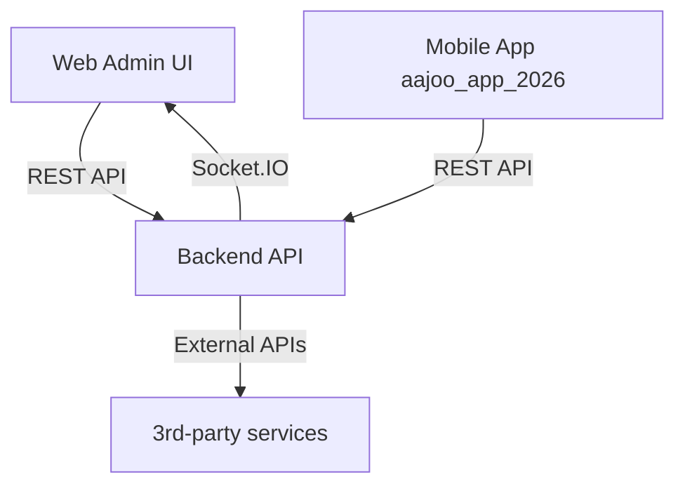
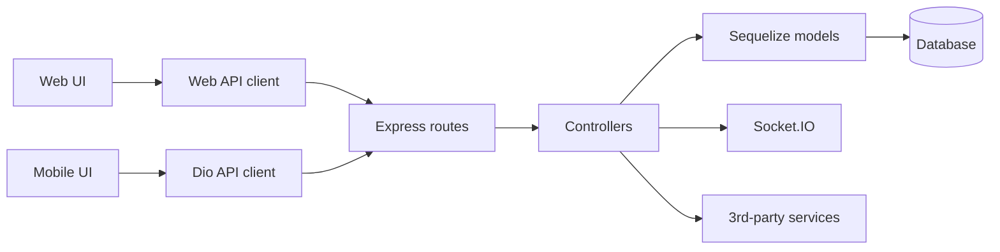

# Codebase Index (Ajoo Admin Website Workspace)

This document maps the three interconnected codebases in this workspace (web admin UI, mobile app UI, backend) and highlights how they connect to each other. It also notes independent areas like docs and scripts.

## 1) Workspace Map (Quick Index)

| Area | Primary entry | Stack | Purpose | Connected to |
| --- | --- | --- | --- | --- |
| Web admin UI | [src/main.tsx](src/main.tsx) | React + Vite + TypeScript | Admin dashboard, host portal, and public web routes | Backend API via Axios | 
| Mobile app UI | [aajoo_app_2026/lib/main.dart](aajoo_app_2026/lib/main.dart) | Flutter + GetX + Dio | Mobile renter/host app | Backend API via Dio | 
| Backend API | [aajooBackend-2026/app.js](aajooBackend-2026/app.js) | Node + Express + Sequelize + Socket.IO | REST API for web + mobile + sockets | Web + Mobile clients | 
| Workspace docs | [README.md](README.md) | Markdown | Project notes and status docs | Standalone | 
| Scripts/tests | [scripts/financeSmoke.js](scripts/financeSmoke.js) | Node scripts | API validation and integration checks | Backend API | 

## 2) High-Level Architecture (Connections)

### Dependency graph (runtime flow)

### Notes on connections
- Web uses environment-driven API base in [src/configs/apiConfigs.ts](src/configs/apiConfigs.ts) and a separate hard-coded API URL in [src/axios/axios.ts](src/axios/axios.ts). This means different Axios instances may point at different servers.
- Backend CORS uses `FRONTEND_URL` (default `http://localhost:5173`) from [aajooBackend-2026/app.js](aajooBackend-2026/app.js). Keep this aligned with the web UI domain.
- Mobile app calls `https://api.aajoohomes.com` by default in services under aajoo_app_2026/lib/service.

## 3) Web Admin UI (React + Vite)

**Entry + routing**
- Entry: [src/main.tsx](src/main.tsx)
- Routing + page layout: [src/App.tsx](src/App.tsx)

**Core structure (top-level folders)**
- UI and routing: src/pages
- State and data: src/redux, src/features
- API clients and contracts: src/axios, src/services, src/configs
- UI system: src/components, src/styles, src/theme

**Auth + session handling**
- Session storage helpers: [src/services/adminSession.ts](src/services/adminSession.ts)
- Protected routes + token verification: [src/components/authGaurd.tsx](src/components/authGaurd.tsx)

**API configuration**
- Env-based base URL: [src/configs/apiConfigs.ts](src/configs/apiConfigs.ts)
- Legacy base URL constant: [src/configs/apis.ts](src/configs/apis.ts)
- Axios instance with hard-coded URL: [src/axios/axios.ts](src/axios/axios.ts)
- Axios instance with env base URL: [src/services/api.ts](src/services/api.ts)

**Runtime configuration**
- Environment variables example: [.env.example](.env.example)
- Build/dev scripts: [package.json](package.json)

## 4) Mobile App UI (Flutter)

There is one Flutter app in this workspace (aajoo_app_2026). The homes-main UI has been merged into the unified UI folder.

**Entry + routing**
- Entry: [aajoo_app_2026/lib/main.dart](aajoo_app_2026/lib/main.dart)

**Core structure**
- UI screens (current): aajoo_app_2026/lib/ui
- UI screens (legacy, not wired): aajoo_app_2026/lib/screens
- Controllers: aajoo_app_2026/lib/controller
- Services: aajoo_app_2026/lib/service

**API configuration**
- Auth API base URL: [aajoo_app_2026/lib/service/auth_service.dart](aajoo_app_2026/lib/service/auth_service.dart)
- Booking API base URL: [aajoo_app_2026/lib/service/booking_service.dart](aajoo_app_2026/lib/service/booking_service.dart)
- Common API base URL: [aajoo_app_2026/lib/service/common_service.dart](aajoo_app_2026/lib/service/common_service.dart)

### 4.2 Merge notes

- The active UI routes now point to aajoo_app_2026/lib/ui.
- Legacy screens remain under aajoo_app_2026/lib/screens for reference but are not wired in main.dart.

## 5) Backend API (Node + Express)

**Entry + server setup**
- Server bootstrap: [aajooBackend-2026/app.js](aajooBackend-2026/app.js)

**Routes (high-level grouping)**
- Admin + CMS: [aajooBackend-2026/routes/admin.routes.js](aajooBackend-2026/routes/admin.routes.js), [aajooBackend-2026/routes/adminCMSSection.routes.js](aajooBackend-2026/routes/adminCMSSection.routes.js)
- Bookings: [aajooBackend-2026/routes/booking.routes.js](aajooBackend-2026/routes/booking.routes.js)
- Users + hosts: [aajooBackend-2026/routes/user.routes.js](aajooBackend-2026/routes/user.routes.js), [aajooBackend-2026/routes/host.routes.js](aajooBackend-2026/routes/host.routes.js)
- Properties + categories/tags: [aajooBackend-2026/routes/property.routes.js](aajooBackend-2026/routes/property.routes.js), [aajooBackend-2026/routes/adminProperty.routes.js](aajooBackend-2026/routes/adminProperty.routes.js)
- Reviews: [aajooBackend-2026/routes/review.routes.js](aajooBackend-2026/routes/review.routes.js)
- Payments + payouts: [aajooBackend-2026/routes/payouts.routes.js](aajooBackend-2026/routes/payouts.routes.js)
- Common metadata: [aajooBackend-2026/routes/common.routes.js](aajooBackend-2026/routes/common.routes.js)
- Blogs: [aajooBackend-2026/routes/blog.routes.js](aajooBackend-2026/routes/blog.routes.js)
- WATI webhook: [aajooBackend-2026/routes/wati.routes.js](aajooBackend-2026/routes/wati.routes.js)

**Controllers (parallel to routes)**
- Controller list: [aajooBackend-2026/controllers/admin.controller.js](aajooBackend-2026/controllers/admin.controller.js) and other controllers in the same folder.

**External integrations**
- WATI service base URL: [aajooBackend-2026/utils/watiService.js](aajooBackend-2026/utils/watiService.js)
- DIDIT config usage: [aajooBackend-2026/didt.text](aajooBackend-2026/didt.text)

### 5.1 Endpoint map (routes)

- [aajooBackend-2026/routes/admin.routes.js](aajooBackend-2026/routes/admin.routes.js): `POST /admin/login`, `POST /admin/logout`, `POST /admin/create`, `GET /admin/dashboard`
- [aajooBackend-2026/routes/adminAnalytics.routes.js](aajooBackend-2026/routes/adminAnalytics.routes.js): `GET /admin/analytics/graph`
- [aajooBackend-2026/routes/adminBooking.routes.js](aajooBackend-2026/routes/adminBooking.routes.js): `POST /admin/booking/search`, `POST /admin/booking/update`, `POST /admin/booking/detail`, `GET /admin/booking/status/list`, `POST /admin/booking/status/update`, `POST /admin/booking/status/listing/admin-page`
- [aajooBackend-2026/routes/adminCMSSection.routes.js](aajooBackend-2026/routes/adminCMSSection.routes.js): `POST /admin/cms/sectio/add`, `POST /admin/cms/section/search`, `POST /admin/cms/homepage/update`, `GET /admin/cms/homepage/get`, `GET /admin/cms/homepage/property/dropdown`, `GET /admin/cms/homepage/testimonial/dropdown`, `POST /admin/cms/homepage/delete/image`, `POST /admin/cms/FaqPage/update`, `GET /admin/cms/FaqPage/get`, `POST /admin/cms/TCPage/update`, `GET /admin/cms/TCPage/get`
- [aajooBackend-2026/routes/adminCoupons.routes.js](aajooBackend-2026/routes/adminCoupons.routes.js): `POST /admin/coupon/add`, `POST /admin/coupon/delete`, `POST /admin/coupon/status/update`, `POST /admin/coupon/search`, `POST /admin/coupon/detail`
- [aajooBackend-2026/routes/adminFAQ.routes.js](aajooBackend-2026/routes/adminFAQ.routes.js): `POST /admin/faq/add`, `POST /admin/faq/listing`, `POST /admin/faq/delete`, `POST /admin/faq/detail`
- [aajooBackend-2026/routes/adminHost.routes.js](aajooBackend-2026/routes/adminHost.routes.js): `POST /admin/host/search`, `GET /admin/host/search/assign-property`
- [aajooBackend-2026/routes/adminPropAnalytics.routes.js](aajooBackend-2026/routes/adminPropAnalytics.routes.js): `POST /admin/properties/analytic/search`, `POST /admin/property/analytic/detail`
- [aajooBackend-2026/routes/adminProperty.routes.js](aajooBackend-2026/routes/adminProperty.routes.js): `POST /admin/property/create`, `POST /admin/properties/search`, `POST /admin/property/delete`, `POST /admin/property`, `POST /admin/properties/update-status`, `POST /admin/properties/delete/image`
- [aajooBackend-2026/routes/adminPropertyAmeneties.routes.js](aajooBackend-2026/routes/adminPropertyAmeneties.routes.js): `POST /admin/amenity/create`, `POST /admin/amenity`, `POST /admin/amenity/delete`, `POST /admin/amenity/search`, `GET /admin/amenity/list/dropdowns`, `POST /admin/amenity/update-status`
- [aajooBackend-2026/routes/adminPropertyCategories.routes.js](aajooBackend-2026/routes/adminPropertyCategories.routes.js): `POST /admin/category/create`, `POST /admin/categories`, `POST /admin/categories/delete`, `POST /admin/category`, `GET /admin/category/list/dropdowns`, `POST /admin/category/update-status`
- [aajooBackend-2026/routes/adminPropertyReviews.routes.js](aajooBackend-2026/routes/adminPropertyReviews.routes.js): `POST /admin/propety/review/search`, `POST /admin/propety/review/update`, `POST /admin/property/review/detail`
- [aajooBackend-2026/routes/adminPropertyTag.routes.js](aajooBackend-2026/routes/adminPropertyTag.routes.js): `POST /admin/tag/create`, `POST /admin/tag/delete`, `POST /admin/tag/search`, `GET /admin/tag/listing/dropdowns`, `POST /admin/tag/single`, `POST /admin/tag/update-status`
- [aajooBackend-2026/routes/adminTermsAndCond.routes.js](aajooBackend-2026/routes/adminTermsAndCond.routes.js): `POST /admin/terms-condition/add`, `POST /admin/terms-condition/listing`, `POST /admin/terms-condition/delete`, `POST /admin/terms-condition/detail`
- [aajooBackend-2026/routes/adminUser.routes.js](aajooBackend-2026/routes/adminUser.routes.js): `POST /admin/user/create`, `POST /admin/user/delete/image`, `POST /admin/user/update/status`, `POST /admin/user/verify`, `POST /admin/user/delete`, `POST /admin/user/search`, `POST /admin/user/single`
- [aajooBackend-2026/routes/blog.routes.js](aajooBackend-2026/routes/blog.routes.js): `POST /blog/create`, `POST /blog/search`, `POST /blog/test-img`
- [aajooBackend-2026/routes/booking.routes.js](aajooBackend-2026/routes/booking.routes.js): `POST /booking/create`, `POST /create/payment-verify`, `POST /create/test`, `POST /user/ongoing/bookings`, `POST /user/ongoing/bookings/payment/create`, `POST /user/cancel/booking`, `POST /test/mail`
- [aajooBackend-2026/routes/common.routes.js](aajooBackend-2026/routes/common.routes.js): `GET /common/states`, `GET /common/country`, `GET /common/amenties`, `GET /common/documents/list`, `GET /common/safety`, `GET /common/about-us`, `GET /common/faq`, `GET /common/term-condition-user`, `GET /common/term-condition-host`, `POST /common/privacy-policy`, `GET /common/tags`, `GET /common/categories`
- [aajooBackend-2026/routes/host.routes.js](aajooBackend-2026/routes/host.routes.js): `POST /host/confirm-book`, `POST /booking/ongoing-host`, `POST /host/property-search`, `POST /host/property/update-status`, `POST /host/delete-property`, `POST /host/update-property-cover`, `POST /host/booking-history`, `POST /host/transaction-history`, `GET /host/profile`, `POST /host/profile/update`, `POST /host/kyc/update`, `GET /host/onboarding/status`, `POST /host/dashboard/summary`, `POST /host/earnings/summary`, `POST /host/earnings/list`, `POST /host/support/ticket`, `POST /host/support/tickets`, `POST /host/support/ticket/detail`, `POST /host/support/ticket/status`, `POST /host/messages/threads`, `POST /host/messages/conversation`, `POST /host/messages/mark-read`
- [aajooBackend-2026/routes/payouts.routes.js](aajooBackend-2026/routes/payouts.routes.js): `POST /payout/account/details-add`, `GET /payout/account/details`, `POST /payout/request/create`, `GET /payout/request/list`, `POST /payout/history`, `POST /payout/history/download`
- [aajooBackend-2026/routes/propCate.routes.js](aajooBackend-2026/routes/propCate.routes.js): `POST /property/cate-filert`
- [aajooBackend-2026/routes/property.routes.js](aajooBackend-2026/routes/property.routes.js): `POST /properties/add`, `POST /properties/search`, `GET /properties/:propId`, `POST /properties/add/cover-pic`, `POST /properties/delete`, `POST /properties/inactive`, `POST /properties/list`, `POST /properties/user-saveProp`, `POST /properties/reviews/list`, `POST /admin/properties/search`, `POST /admin/properties/load`
- [aajooBackend-2026/routes/review.routes.js](aajooBackend-2026/routes/review.routes.js): `POST /review/like`, `POST /review/dislike`, `POST /review/user/delete-review`, `POST /review/user/checkout`, `POST /review/host/add-user-review`, `GET /review/host/user-review-list`
- [aajooBackend-2026/routes/user.routes.js](aajooBackend-2026/routes/user.routes.js): `POST /user/signup`, `POST /user/login`, `POST /user/logout`, `POST /user/update`, `POST /user/delete/profile-pic`, `POST /user/add/profile-pic`, `POST /user/is-exist`, `GET /user/detail`, `POST /user/otp-again`, `POST /user/verify-otp`, `POST /user/review-add`, `POST /user/delete`, `POST /user/notification/allow-notification`, `POST /user/notification/mark-read`, `GET /user/notification/Listing`, `POST /user/forget-password`, `POST /user/forget/verify-otp`, `POST /user/update/forget-password`, `POST /user/history`, `POST /user/update-password`, `POST /user/saved-properties`, `GET /user/booking-history`
- [aajooBackend-2026/routes/wati.routes.js](aajooBackend-2026/routes/wati.routes.js): `POST /api/wati/webhook`, `POST /test-intent`

### 5.2 Client usage map (web + mobile)

Note: This maps endpoints referenced by clients. Some web endpoints are declared in [src/services/endpoints.ts](src/services/endpoints.ts) but may not yet exist in backend routes.

**User auth and profile**

| Endpoint | Web client | Mobile (aajoo_app_2026) |
| --- | --- | --- | --- |
| `/user/login` | [src/redux/authSllice.tsx](src/redux/authSllice.tsx) | [aajoo_app_2026/lib/service/auth_service.dart](aajoo_app_2026/lib/service/auth_service.dart) |
| `/user/signup` | — | [aajoo_app_2026/lib/service/auth_service.dart](aajoo_app_2026/lib/service/auth_service.dart) |
| `/user/verify-otp` | — | [aajoo_app_2026/lib/service/auth_service.dart](aajoo_app_2026/lib/service/auth_service.dart) |
| `/user/detail` | [src/redux/authSllice.tsx](src/redux/authSllice.tsx) | [aajoo_app_2026/lib/service/auth_service.dart](aajoo_app_2026/lib/service/auth_service.dart) |
| `/user/otp-again` | — | [aajoo_app_2026/lib/service/auth_service.dart](aajoo_app_2026/lib/service/auth_service.dart) |
| `/user/update` | — | [aajoo_app_2026/lib/service/auth_service.dart](aajoo_app_2026/lib/service/auth_service.dart) |
| `/user/is-exist` | — | [aajoo_app_2026/lib/service/auth_service.dart](aajoo_app_2026/lib/service/auth_service.dart) |
| `/user/delete` | — | [aajoo_app_2026/lib/service/auth_service.dart](aajoo_app_2026/lib/service/auth_service.dart) |
| `/user/booking-history` | — | [aajoo_app_2026/lib/service/user_service.dart](aajoo_app_2026/lib/service/user_service.dart) |
| `/user/ongoing/bookings` | — | [aajoo_app_2026/lib/service/user_service.dart](aajoo_app_2026/lib/service/user_service.dart) |
| `/user/review-add` | — | [aajoo_app_2026/lib/service/user_service.dart](aajoo_app_2026/lib/service/user_service.dart) |
| `/user/add/profile-pic` | — | [aajoo_app_2026/lib/service/user_service.dart](aajoo_app_2026/lib/service/user_service.dart) |

**Forgot password**

| Endpoint | Web client | Mobile (aajoo_app_2026) |
| --- | --- | --- | --- |
| `/user/forget-password` | [src/redux/authSllice.tsx](src/redux/authSllice.tsx) | [aajoo_app_2026/lib/service/forgot_password_service.dart](aajoo_app_2026/lib/service/forgot_password_service.dart) |
| `/user/forget/verify-otp` | [src/redux/authSllice.tsx](src/redux/authSllice.tsx) | [aajoo_app_2026/lib/service/forgot_password_service.dart](aajoo_app_2026/lib/service/forgot_password_service.dart) |
| `/user/update/forget-password` | [src/redux/authSllice.tsx](src/redux/authSllice.tsx) | [aajoo_app_2026/lib/service/forgot_password_service.dart](aajoo_app_2026/lib/service/forgot_password_service.dart) |

**Notifications**

| Endpoint | Web client | Mobile (aajoo_app_2026) |
| --- | --- | --- | --- |
| `/user/notification/allow-notification` | — | [aajoo_app_2026/lib/service/notification_service.dart](aajoo_app_2026/lib/service/notification_service.dart) |
| `/user/notification/Listing` | — | [aajoo_app_2026/lib/service/notification_service.dart](aajoo_app_2026/lib/service/notification_service.dart) |

**Properties and search**

| Endpoint | Web client | Mobile (aajoo_app_2026) |
| --- | --- | --- | --- |
| `/properties/search` | — | [aajoo_app_2026/lib/service/map_service.dart](aajoo_app_2026/lib/service/map_service.dart) |
| `/properties/list` | — | [aajoo_app_2026/lib/service/map_service.dart](aajoo_app_2026/lib/service/map_service.dart), [aajoo_app_2026/lib/service/home_page_search_service.dart](aajoo_app_2026/lib/service/home_page_search_service.dart) |
| `/properties/add` | — | [aajoo_app_2026/lib/service/property_service.dart](aajoo_app_2026/lib/service/property_service.dart) |
| `/properties/add/cover-pic` | — | [aajoo_app_2026/lib/service/property_service.dart](aajoo_app_2026/lib/service/property_service.dart) |
| `/properties/reviews/list` | — | [aajoo_app_2026/lib/service/property_service.dart](aajoo_app_2026/lib/service/property_service.dart) |
| `/properties/:id` | — | [aajoo_app_2026/lib/service/property_service.dart](aajoo_app_2026/lib/service/property_service.dart), [aajoo_app_2026/lib/service/booking_service.dart](aajoo_app_2026/lib/service/booking_service.dart) |

**Bookings and payments**

| Endpoint | Web client | Mobile (aajoo_app_2026) |
| --- | --- | --- | --- |
| `/booking/create` | — | [aajoo_app_2026/lib/service/booking_service.dart](aajoo_app_2026/lib/service/booking_service.dart) |
| `/create/payment-verify` | — | [aajoo_app_2026/lib/service/booking_service.dart](aajoo_app_2026/lib/service/booking_service.dart) |
| `/user/cancel/booking` | — | [aajoo_app_2026/lib/service/booking_service.dart](aajoo_app_2026/lib/service/booking_service.dart) |
| `/user/ongoing/bookings/payment/create` | — | [aajoo_app_2026/lib/service/booking_service.dart](aajoo_app_2026/lib/service/booking_service.dart) |
| `/booking/ongoing-host` | — | [aajoo_app_2026/lib/service/host_service.dart](aajoo_app_2026/lib/service/host_service.dart) |
| `/host/booking-history` | — | [aajoo_app_2026/lib/service/host_service.dart](aajoo_app_2026/lib/service/host_service.dart) |
| `/host/transaction-history` | — | [aajoo_app_2026/lib/service/host_service.dart](aajoo_app_2026/lib/service/host_service.dart) |

**Host property management**

| Endpoint | Web client | Mobile (aajoo_app_2026) |
| --- | --- | --- | --- |
| `/host/property-search` | — | [aajoo_app_2026/lib/service/host_service.dart](aajoo_app_2026/lib/service/host_service.dart) |
| `/host/property/update-status` | — | [aajoo_app_2026/lib/service/host_service.dart](aajoo_app_2026/lib/service/host_service.dart) |
| `/host/delete-property` | — | [aajoo_app_2026/lib/service/property_service.dart](aajoo_app_2026/lib/service/property_service.dart) |

**Reviews**

| Endpoint | Web client | Mobile (aajoo_app_2026) |
| --- | --- | --- | --- |
| `/review/like` | — | [aajoo_app_2026/lib/service/property_service.dart](aajoo_app_2026/lib/service/property_service.dart) |
| `/review/dislike` | — | [aajoo_app_2026/lib/service/property_service.dart](aajoo_app_2026/lib/service/property_service.dart) |
| `/review/host/add-user-review` | — | [aajoo_app_2026/lib/service/host_service.dart](aajoo_app_2026/lib/service/host_service.dart) |
| `/review/host/user-review-list` | — | [aajoo_app_2026/lib/service/user_service.dart](aajoo_app_2026/lib/service/user_service.dart) |

**Common and static content**

| Endpoint | Web client | Mobile (aajoo_app_2026) |
| --- | --- | --- | --- |
| `/common/amenties` | — | [aajoo_app_2026/lib/service/common_service.dart](aajoo_app_2026/lib/service/common_service.dart) |
| `/common/categories` | — | [aajoo_app_2026/lib/service/common_service.dart](aajoo_app_2026/lib/service/common_service.dart) |
| `/common/tags` | — | [aajoo_app_2026/lib/service/common_service.dart](aajoo_app_2026/lib/service/common_service.dart) |
| `/common/documents/list` | — | [aajoo_app_2026/lib/service/common_service.dart](aajoo_app_2026/lib/service/common_service.dart) |
| `/common/about-us` | — | [aajoo_app_2026/lib/service/static_page_service.dart](aajoo_app_2026/lib/service/static_page_service.dart) |
| `/common/safety` | — | [aajoo_app_2026/lib/service/static_page_service.dart](aajoo_app_2026/lib/service/static_page_service.dart) |
| `/common/faq` | — | [aajoo_app_2026/lib/service/static_page_service.dart](aajoo_app_2026/lib/service/static_page_service.dart) |
| `/common/term-condition-user` | — | [aajoo_app_2026/lib/service/static_page_service.dart](aajoo_app_2026/lib/service/static_page_service.dart) |
| `/common/privacy-policy` | — | [aajoo_app_2026/lib/service/static_page_service.dart](aajoo_app_2026/lib/service/static_page_service.dart) |

**Payouts (mobile host)**

| Endpoint | Web client | Mobile (aajoo_app_2026) |
| --- | --- | --- | --- |
| `/payout/request/create` | — | [aajoo_app_2026/lib/service/host_payout_service.dart](aajoo_app_2026/lib/service/host_payout_service.dart) |
| `/payout/request/list` | — | [aajoo_app_2026/lib/service/host_payout_service.dart](aajoo_app_2026/lib/service/host_payout_service.dart) |

**Host onboarding (web public)**

| Endpoint | Web client | Mobile (aajoo_app_2026) |
| --- | --- | --- |
| `/host/onboarding/submit` | [src/pages/user/BecomeHost.tsx](src/pages/user/BecomeHost.tsx) | — |

**Web admin + host portal endpoints (declared)**

| Endpoint | Web client |
| --- | --- |
| `/admin/login` | [src/services/endpoints.ts](src/services/endpoints.ts) |
| `/admin/dashboard` | [src/services/endpoints.ts](src/services/endpoints.ts) |
| `/admin/user/search` | [src/services/endpoints.ts](src/services/endpoints.ts) |
| `/admin/user/single` | [src/services/endpoints.ts](src/services/endpoints.ts) |
| `/admin/user/create` | [src/services/endpoints.ts](src/services/endpoints.ts) |
| `/admin/user/delete/image` | [src/services/endpoints.ts](src/services/endpoints.ts) |
| `/admin/user/delete` | [src/services/endpoints.ts](src/services/endpoints.ts) |
| `/admin/host/search` | [src/services/endpoints.ts](src/services/endpoints.ts) |
| `/admin/user/update/status` | [src/services/endpoints.ts](src/services/endpoints.ts) |
| `/admin/host/search/assign-property` | [src/services/endpoints.ts](src/services/endpoints.ts) |
| `/admin/host/kyc/approve` | [src/services/endpoints.ts](src/services/endpoints.ts) |
| `/admin/host/kyc/reject` | [src/services/endpoints.ts](src/services/endpoints.ts) |
| `admin/categories` | [src/services/endpoints.ts](src/services/endpoints.ts) |
| `admin/category` | [src/services/endpoints.ts](src/services/endpoints.ts) |
| `/admin/category/create` | [src/services/endpoints.ts](src/services/endpoints.ts) |
| `/admin/category/update-status` | [src/services/endpoints.ts](src/services/endpoints.ts) |
| `/admin/categories/delete` | [src/services/endpoints.ts](src/services/endpoints.ts) |
| `/admin/category/list/dropdowns` | [src/services/endpoints.ts](src/services/endpoints.ts) |
| `admin/tag/search` | [src/services/endpoints.ts](src/services/endpoints.ts) |
| `admin/tag/single` | [src/services/endpoints.ts](src/services/endpoints.ts) |
| `/admin/tag/create` | [src/services/endpoints.ts](src/services/endpoints.ts) |
| `/admin/tag/update-status` | [src/services/endpoints.ts](src/services/endpoints.ts) |
| `/admin/tag/delete` | [src/services/endpoints.ts](src/services/endpoints.ts) |
| `/admin/tag/listing/dropdowns` | [src/services/endpoints.ts](src/services/endpoints.ts) |
| `admin/amenity/search` | [src/services/endpoints.ts](src/services/endpoints.ts) |
| `admin/amenity` | [src/services/endpoints.ts](src/services/endpoints.ts) |
| `/admin/amenity/create` | [src/services/endpoints.ts](src/services/endpoints.ts) |
| `/admin/amenity/update-status` | [src/services/endpoints.ts](src/services/endpoints.ts) |
| `/admin/amenity/delete` | [src/services/endpoints.ts](src/services/endpoints.ts) |
| `/admin/amenity/list/dropdowns` | [src/services/endpoints.ts](src/services/endpoints.ts) |
| `admin/properties/search` | [src/services/endpoints.ts](src/services/endpoints.ts) |
| `/admin/property` | [src/services/endpoints.ts](src/services/endpoints.ts) |
| `/admin/property/create` | [src/services/endpoints.ts](src/services/endpoints.ts) |
| `/admin/properties/update-status` | [src/services/endpoints.ts](src/services/endpoints.ts) |
| `/admin/property/delete` | [src/services/endpoints.ts](src/services/endpoints.ts) |
| `/admin/properties/delete/image` | [src/services/endpoints.ts](src/services/endpoints.ts) |
| `/admin/booking/search` | [src/services/endpoints.ts](src/services/endpoints.ts) |
| `/admin/booking/detail` | [src/services/endpoints.ts](src/services/endpoints.ts) |
| `/admin/booking/status/list` | [src/services/endpoints.ts](src/services/endpoints.ts) |
| `/admin/booking/update` | [src/services/endpoints.ts](src/services/endpoints.ts) |
| `/admin/booking/status/listing/admin-page` | [src/services/endpoints.ts](src/services/endpoints.ts) |
| `/admin/booking/status/update` | [src/services/endpoints.ts](src/services/endpoints.ts) |
| `/admin/finance/ledger/search` | [src/services/endpoints.ts](src/services/endpoints.ts) |
| `/admin/finance/ledger` | [src/services/endpoints.ts](src/services/endpoints.ts) |
| `/admin/finance/ledger/host` | [src/services/endpoints.ts](src/services/endpoints.ts) |
| `/admin/finance/ledger/user` | [src/services/endpoints.ts](src/services/endpoints.ts) |
| `/admin/finance/ledger/export` | [src/services/endpoints.ts](src/services/endpoints.ts) |
| `/admin/finance/payout/search` | [src/services/endpoints.ts](src/services/endpoints.ts) |
| `/admin/finance/payout` | [src/services/endpoints.ts](src/services/endpoints.ts) |
| `/admin/finance/payout/initiate` | [src/services/endpoints.ts](src/services/endpoints.ts) |
| `/admin/finance/payout/approve` | [src/services/endpoints.ts](src/services/endpoints.ts) |
| `/admin/finance/payout/reject` | [src/services/endpoints.ts](src/services/endpoints.ts) |
| `/admin/finance/payout/schedule/search` | [src/services/endpoints.ts](src/services/endpoints.ts) |
| `/admin/finance/payout/schedule/create` | [src/services/endpoints.ts](src/services/endpoints.ts) |
| `/admin/finance/payout/schedule/update` | [src/services/endpoints.ts](src/services/endpoints.ts) |
| `/admin/finance/invoice/search` | [src/services/endpoints.ts](src/services/endpoints.ts) |
| `/admin/finance/invoice` | [src/services/endpoints.ts](src/services/endpoints.ts) |
| `/admin/finance/invoice/download` | [src/services/endpoints.ts](src/services/endpoints.ts) |
| `/admin/finance/invoice/void` | [src/services/endpoints.ts](src/services/endpoints.ts) |
| `/admin/finance/reconciliation/search` | [src/services/endpoints.ts](src/services/endpoints.ts) |
| `/admin/finance/reconciliation` | [src/services/endpoints.ts](src/services/endpoints.ts) |
| `/admin/finance/reconciliation/resolve` | [src/services/endpoints.ts](src/services/endpoints.ts) |
| `/admin/finance/reconciliation/run` | [src/services/endpoints.ts](src/services/endpoints.ts) |
| `/admin/finance/dashboard` | [src/services/endpoints.ts](src/services/endpoints.ts) |
| `/admin/finance/reports/revenue` | [src/services/endpoints.ts](src/services/endpoints.ts) |
| `/admin/finance/reports/commission` | [src/services/endpoints.ts](src/services/endpoints.ts) |
| `/admin/finance/reports/tax` | [src/services/endpoints.ts](src/services/endpoints.ts) |
| `/admin/finance/reports/cashflow` | [src/services/endpoints.ts](src/services/endpoints.ts) |
| `/admin/finance/reports/export` | [src/services/endpoints.ts](src/services/endpoints.ts) |
| `/host/dashboard/summary` | [src/services/endpoints.ts](src/services/endpoints.ts) |
| `/host/bookings/search` | [src/services/endpoints.ts](src/services/endpoints.ts) |
| `/host/bookings/detail` | [src/services/endpoints.ts](src/services/endpoints.ts) |
| `/host/bookings/export` | [src/services/endpoints.ts](src/services/endpoints.ts) |
| `/host/earnings/summary` | [src/services/endpoints.ts](src/services/endpoints.ts) |
| `/host/payout/history` | [src/services/endpoints.ts](src/services/endpoints.ts) |
| `/host/profile` | [src/services/endpoints.ts](src/services/endpoints.ts) |
| `/host/profile/update` | [src/services/endpoints.ts](src/services/endpoints.ts) |
| `/host/payout-account/get` | [src/services/endpoints.ts](src/services/endpoints.ts) |
| `/host/payout-account/update` | [src/services/endpoints.ts](src/services/endpoints.ts) |
| `/host/statements/search` | [src/services/endpoints.ts](src/services/endpoints.ts) |
| `/host/statements/download` | [src/services/endpoints.ts](src/services/endpoints.ts) |
| `/host/support/tickets/search` | [src/services/endpoints.ts](src/services/endpoints.ts) |
| `/host/support/tickets/create` | [src/services/endpoints.ts](src/services/endpoints.ts) |
| `/host/support/tickets/reply` | [src/services/endpoints.ts](src/services/endpoints.ts) |
| `/host/messages/list` | [src/services/endpoints.ts](src/services/endpoints.ts) |
| `/host/messages/send` | [src/services/endpoints.ts](src/services/endpoints.ts) |
| `/host/messages/mark-read` | [src/services/endpoints.ts](src/services/endpoints.ts) |
| `/host/performance/summary` | [src/services/endpoints.ts](src/services/endpoints.ts) |

## 6) Config + Environment

- Web env example (API base, dev bypass toggles): [.env.example](.env.example)
- Backend env is loaded with `dotenv` in [aajooBackend-2026/app.js](aajooBackend-2026/app.js)

## 7) Independent / Supporting Areas

- Planning and status docs: [TASK_TRACKER.md](TASK_TRACKER.md), [QUICK_STATUS_SUMMARY.md](QUICK_STATUS_SUMMARY.md), [HMS_SPRINT_PLAN.md](HMS_SPRINT_PLAN.md)
- Reports: [BACKEND_OPTIMIZATION_REPORT.md](BACKEND_OPTIMIZATION_REPORT.md), [FRONTEND_OPTIMIZATION_REPORT.md](FRONTEND_OPTIMIZATION_REPORT.md)
- Integration reports: [reports/finance-integration-report.md](reports/finance-integration-report.md)

## 8) Potential Follow-Ups / Open Questions

1) Do we want to consolidate API base URL configuration in the web app (currently split between [src/configs/apiConfigs.ts](src/configs/apiConfigs.ts) and [src/axios/axios.ts](src/axios/axios.ts))?
2) Should we align mobile base URL values to environment configs rather than hard-coded constants?

