# Negotiation Engine — Every Journey, Both Sides

This document walks the complete negotiation engine as it now runs on
**www.aajoohomes.com**. Every screen in it is a photograph of the live site,
taken while driving the real flow against a real listing with a real guest
account and a real host account — nothing here is a mock-up or a design comp.

Each scenario shows **what the guest sees** and, where the host is involved,
**what the host sees** for the same moment.

---

## 1. The three prices

Every listing carries three prices. The host sets them once, in Step 4 of the
listing wizard.

| Price | Who sees it | What it means |
|---|---|---|
| **Maximum** (list price) | **The guest** — it is the price on the page | What the stay costs without negotiating |
| **Ideal** | Nobody outside the platform | The host's target. An offer at or above it is accepted with no host involvement |
| **Minimum** | **Nobody. Ever.** | The host's floor. Only the host may sell below their target, and only by saying so themselves |

> **The rule everything else protects:** a guest must never be able to work out
> the minimum. If they could, every guest would offer exactly that and the
> margin above it would be gone. Section 5 shows how the engine makes that
> impossible rather than merely unlikely.

**The listing used throughout** — a real listing on the live site, so the
numbers below are the numbers in the screenshots:

| The listing | Per night |
|---|---|
| List price | **₹2,000** |
| Ideal | **₹1,700** |
| Minimum | **₹1,500** |

---

## 2. The decision, in one table

| The guest offers | What happens | Is the host contacted? |
|---|---|---|
| Above ₹2,000 (the list price) | Refused — there is nothing to negotiate upward | No |
| **₹1,700 or more** (at or above the ideal) | **Accepted instantly, at the price they offered** | Told, not asked |
| Below ₹1,700 | **Countered instantly**, between the ideal and the list price | No |
| Below ₹1,500 (under the minimum) | Countered the same way — no difference the guest can detect | No |
| *…guest accepts the counter* | Deal struck, discount code issued, valid until midnight | Told |
| *…guest counters back, below the ideal* | **Goes to the host** — email, and a notification on web and app | **Asked**, with 90 seconds before the guest is told they are away |
| *…guest counters back, at or above the ideal* | Accepted on the spot | Told |
| Stay starts **tomorrow or later** | Not negotiable — an advance booking at the listed price, reservable with 10% now | No |

Two design decisions worth stating plainly, because they are the ones that
earn money:

1. **The counter runs downward from the list price, not up from the ideal.**
   The worse the offer, the firmer the answer — a guest offering ₹100 is quoted
   ₹1,900, one offering ₹1,600 is quoted ₹1,700. **Every counter is worth at
   least as much to the host as an instant acceptance would have been.**
2. **The host is not woken for round one.** The platform answers using the
   host's own published rate. Their judgement is asked for only once a guest
   has argued back — the point at which it actually adds something.

---

## 3. Scenario 1 — The guest offers at or above the ideal

**Accepted on the spot, at the price the guest offered.** The host is informed;
nothing is asked of them.

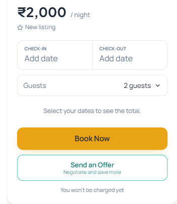

*The listing as a guest finds it. "Send an Offer — negotiate and save more" sits under "Book Now": negotiating is offered, never forced.*

*The guest names their price and the nights they want. The deal will be locked to exactly these dates.*

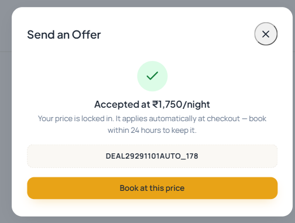

*Accepted immediately at ₹1,750 — the price the guest offered, not the ideal and not the list price. The code carries that rate into checkout.*

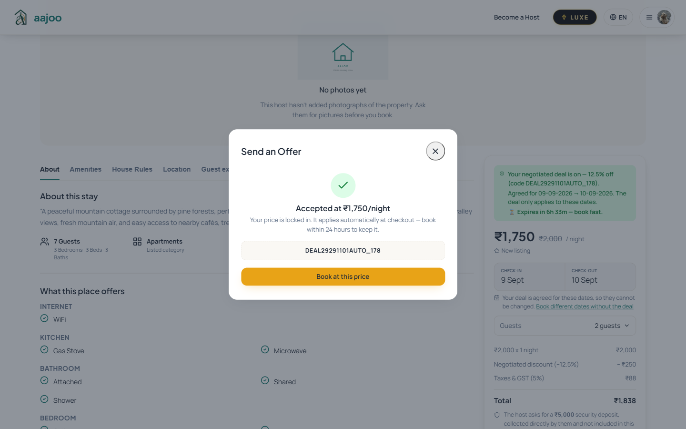

*The rail updates itself: the agreed rate against the struck-through list price, the discount as a line item, tax on the discounted amount, and the total actually payable.*

---

## 4. Scenario 2 — The guest offers below the ideal

**Answered in about a second, by the platform, at a price between the ideal and
the list price.** The host is not contacted at all.

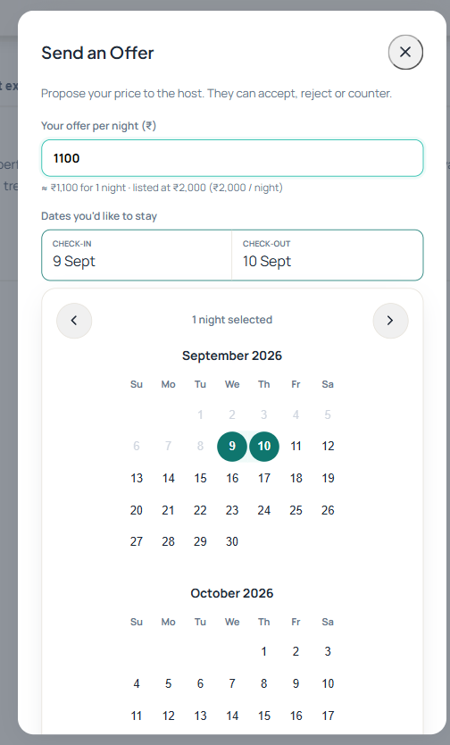

*₹1,100 against a ₹2,000 listing.*

*The answer, immediately. Note the wording: it thanks the guest, says plainly that the offer is under what the dates go for, names a price they can actually take, and names the next step. It never sounds automated, and it never claims the host has been asked.*

Before this was built, an offer like this went to the host's inbox and the
guest waited up to ninety seconds. Now the common case is settled while they
are still looking at the listing.

### A lowball buys a firmer answer, not a cheaper one

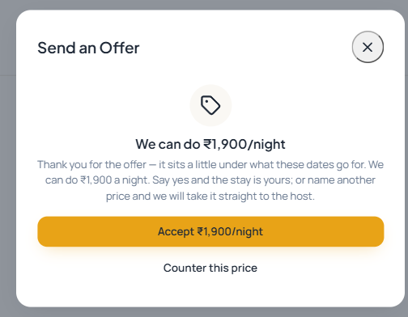

*An offer of ₹100 is countered at ₹1,900 — nearly the full list price. The further below the mark the offer sits, the closer to the screen price the answer comes back.*

---

## 5. Scenario 3 — Why the minimum cannot be found

This is the scenario that protects the host's floor.

A guest hunting for the minimum would look for the point where the platform's
behaviour changes. **There is no such point.** Here are three offers — one
below the ₹1,500 minimum, one exactly on it, one above it:

*Offered ₹1,490, which is **under** the host's floor.*

*Offered ₹1,500, which is **exactly** the host's floor.*

*Offered ₹1,510, which is **above** it.*

> **All three come back identical: ₹1,700, in the same words.**
>
> The counter is calculated from the ideal and the list price. The minimum is
> not part of the arithmetic at all, so no offer's answer changes when the
> minimum changes — and a guest lowballing twice learns nothing the first
> attempt did not already tell them.
>
> The floor is not merely hidden. There is no question a guest can ask that
> finds it.

---

## 6. Scenario 4 — The guest takes the counter

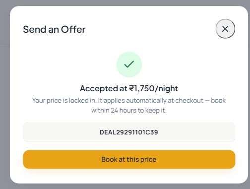

*Accepted, with the code that carries the rate into checkout.*

*The deal is fixed to these dates, and expires at midnight.*

---

## 7. Scenario 5 — The guest argues back, below the ideal

**This is the only point at which the host is interrupted.**

### The guest's side

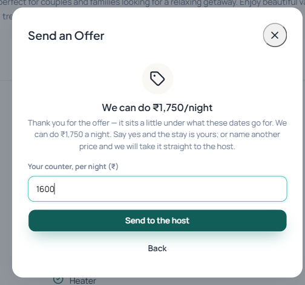

*The guest names a different price. It must be below the counter — a guest trying to "counter" at or above it is told to simply accept instead.*

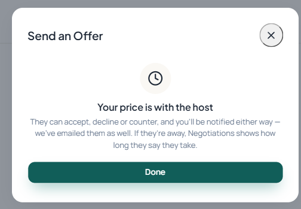

*The guest is told plainly where their price has gone, and that the host has been emailed as well as notified.*

### The host's side

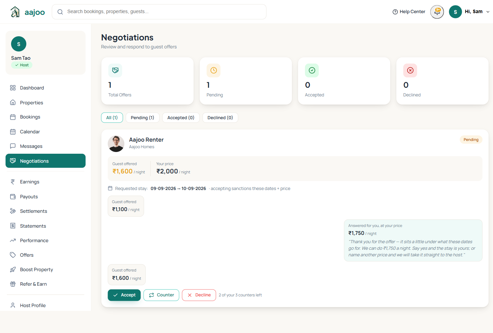

*The whole exchange, in order: the guest's ₹1,100, the counter sent at ₹1,750 on the host's behalf — labelled so the host knows it was not their typing — and the guest's ₹1,600 now awaiting a decision. Accept, Counter and Decline, with the number of counters left.*

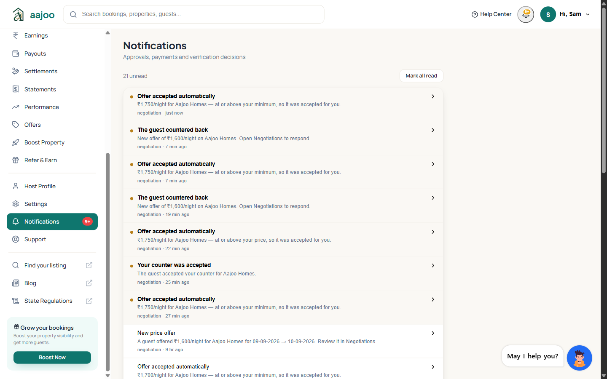

*The host is reached three ways at once — email, a web notification and a push notification on the app — because an offer nobody sees is an offer that expires. Note that automatic acceptances are reported too: the host is kept informed of every outcome, and asked only about this one.*

**The 90-second rule.** If the host has not answered within ninety seconds,
the guest is told the host is away *and how long that host says they take to
reply* — the figure the host themselves entered in the listing wizard. It is
visible in section 11: **"Sam Tao is away at the moment. They usually reply
within 1 hour."** Nothing is decided on the host's behalf; the guest is told
the truth rather than left watching a spinner.

---

## 8. Scenario 6 — The guest argues back, at or above the ideal

*A counter-back that clears the ideal is accepted immediately and the code is issued. Sending this to the host would have meant waiting for a yes the engine already gives.*

---

## 9. Scenario 7 — An offer above the list price

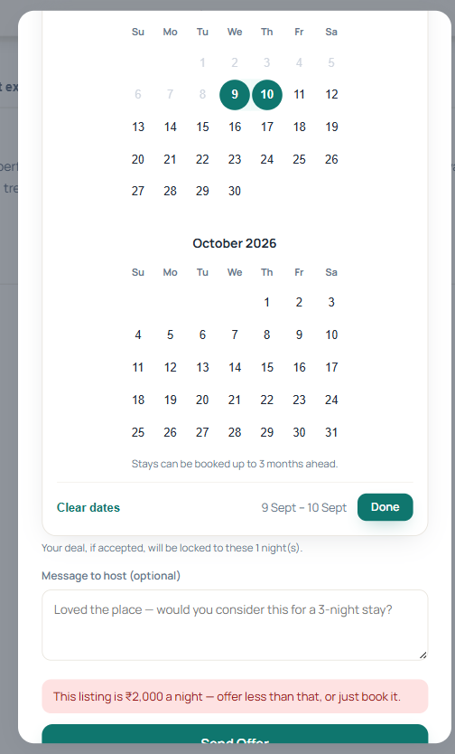

*There is nothing to negotiate above the price already on the page. Caught before it reaches the host, and the guest is pointed at the Book button instead.*

---

## 10. Scenario 8 — A stay starting tomorrow

Negotiation applies to stays **starting today**. A stay starting tomorrow or
later is an **advance booking**: it goes at the listed price, reservable with
10% now and the balance before check-in.

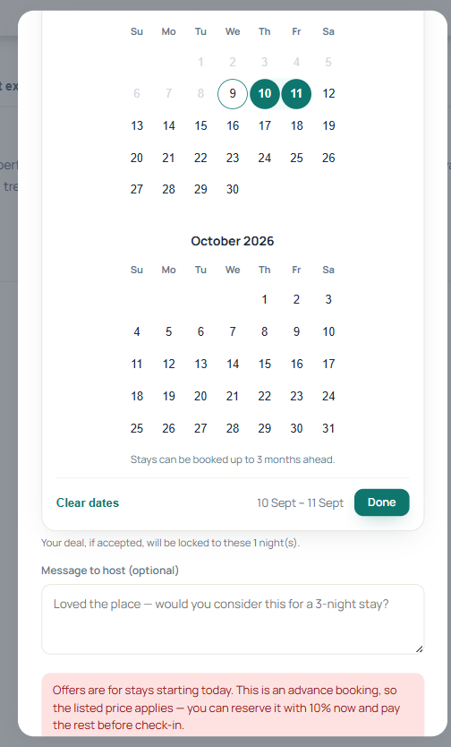

*The refusal names the alternative rather than just saying no.*

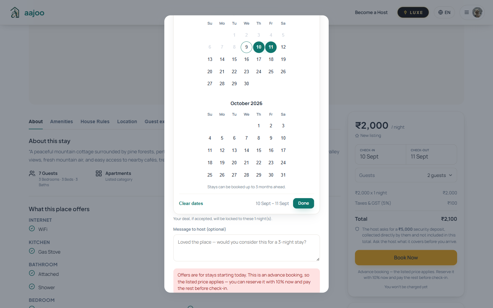

*The booking rail explains the 10% route, so the guest is never left guessing why the price will not move.*

---

## 11. The guest's own record

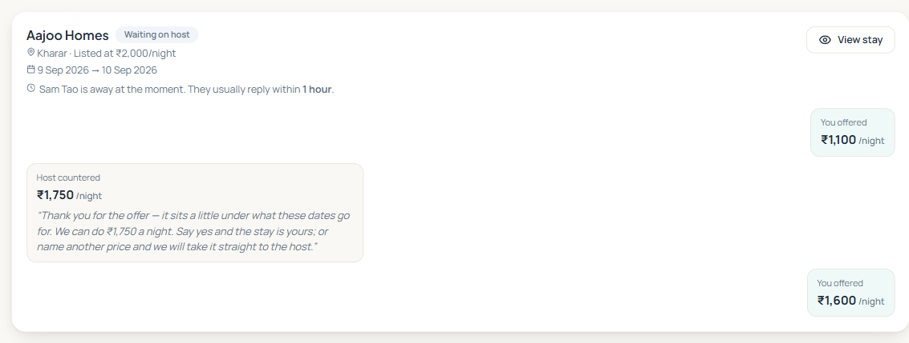

*The same conversation from the guest's side: their ₹1,100, the counter at ₹1,750, their ₹1,600 — and, because the host has now had their ninety seconds, the line telling them how long this host says they take. The response time is the host's own figure from the listing wizard; a host who never gave one is never quoted a number.*

---

## 12. What protects the host

| Protection | How it works |
|---|---|
| The minimum never leaks | The counter is calculated from the ideal and the list price. The minimum is not in the arithmetic, so no offer's answer moves when it moves |
| No counter is worth less than an acceptance | Every counter sits at or above the ideal |
| A lowball is never rewarded | The lower the offer, the higher the counter |
| The host is never interrupted needlessly | Round one is answered by the platform; only a guest who argues reaches a person |
| The host always knows what was done for them | Every automatic acceptance and every counter sent on their behalf is reported, and marked as automatic on their own screen |
| Offers cannot run forever | Each guest gets a limited number of offers per stay (the host sets this; the default is 3), and an offer waiting on a host expires after 30 minutes |
| A deal cannot drift | An accepted price is locked to the exact nights and party it was agreed for, and expires at midnight |
| Nothing is sold below the target without the host | The platform never accepts a below-ideal price on the host's behalf. Only the host can |

---

## 13. What we would like you to confirm

1. **The ladder** — accept at or above the ideal; counter between the ideal and
   the list price; the host only for round two.
2. **Where the counter sits.** It currently runs down from the list price, so
   it earns more than an instant acceptance. The alternative is to place it
   between the guest's offer and the ideal, which conceals the ideal more
   thoroughly but earns less. **We recommend the current setting.**
3. **The wording of the counter**, shown in section 4.
4. **The 90-second window** before a guest is told the host is away.
5. **The three-offer limit** per guest per stay, and the 30-minute expiry on an
   offer waiting with a host.

Once these are confirmed we will close the module.

---

*Every screenshot in this document was taken on the live site on 9 September
2026, driving the real flow against a live listing with a real guest and host
account. The test records created for these photographs have been removed.*
