# Negotiation Engine — Every Journey, Both Sides

This document walks the negotiation engine as it runs today on
**www.aajoohomes.com**, after the rebuild of **12 September 2026**. Every screen
in it is a photograph of the live site, taken while driving the real flow with a
real guest account and a real host account. Nothing here is a mock-up.

It replaces the 9 September edition. Section 15 lists what changed and why, so
the two can be read against each other.

Each scenario shows **what the guest sees** and, where a host is involved,
**what the host sees at the same moment**.

---

## 1. The three prices

Every listing carries three prices. The host sets them once, in Step 4 of the
listing wizard.

| Price | Who sees it | What it means |
|---|---|---|
| **List price** | **The guest** — it is the price on the page | What the stay costs without negotiating |
| **Ideal** | Nobody outside the platform | The host's target. An offer at or above it is accepted with no host involvement |
| **Minimum** | **Nobody. Ever.** | The host's floor. Only the host may sell below their target, and only by saying so themselves |

> **The rule everything else protects:** a guest must never be able to work out
> the minimum. If they could, every guest would offer exactly that and the
> margin above it would be gone. Section 6 shows how the engine makes that
> impossible rather than merely unlikely.

### The prices are the ones for the nights being argued over

This is new since the last edition and it changes every number in the document.
A listing's nightly column is what it costs on an ordinary night; weekend and
seasonal rates make a particular night cost something else. **Every figure in
the engine is now the figure for the dates in the offer** — the price the guest
is shown, the ceiling an offer is measured against, the accept line, the
counter, the discount the coupon carries, and both sides' negotiation cards.

**The listing used throughout** — a real listing on the live site, so the
numbers below are the numbers in the screenshots:

| Aajoo Homes (Kharar) | Nightly column | **12–13 September** (a weekend night) |
|---|---|---|
| List price | ₹2,000 | **₹2,500** |
| Ideal | ₹1,700 | **₹2,300** |
| Minimum | ₹1,500 | **₹2,000** |

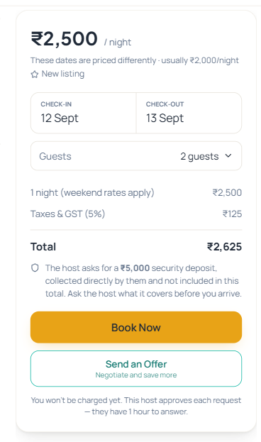

*The booking rail before anything has been offered. The headline is ₹2,500 because these dates are a weekend — and it says so, rather than leaving a guest to wonder why the page disagrees with the search results. "Send an Offer — negotiate and save more" sits under "Book Now": negotiating is offered, never forced.*

---

## 2. The decision, in one table

| The guest offers | What happens | Is the host contacted? |
|---|---|---|
| Above ₹2,500 (what these nights cost) | Refused before it is sent, with that figure named | No |
| **₹2,300 or more** (at or above the ideal) | **Accepted instantly, at the price they offered** | Told, not asked |
| Below ₹2,300 | **Answered instantly**, between the ideal and the list price | No |
| Below ₹2,000 (under the minimum) | Answered the same way — no difference the guest can detect | No |
| *…guest accepts that answer* | Deal struck, discount code issued, locked to those nights | Told |
| *…guest names another price, still below the ideal* | **Goes to the host** — a popup, an email, and a push notification | **Asked** |
| *…guest names another price, at or above the ideal* | Accepted on the spot | Told |
| *…and again, and again* | **No limit.** A thread runs until somebody settles it | Only for the rounds that reach them |
| *…host declines* | Thread ends. **Their last price stays on the table for one hour**, locked to those nights, and that guest cannot open another negotiation on that listing until midnight | Their own decision |
| Stay starts **tomorrow or later** | Not negotiable — an advance booking at the listed price, reservable with 10% now | No |

Three design decisions worth stating plainly, because they are the ones that
earn money:

1. **The answer to round one runs down from the list price, not up from the
   ideal.** The worse the offer, the firmer the answer. **No automatic answer
   is ever worth less to the host than an instant acceptance would have been.**
2. **The host is not woken for round one.** The platform answers using the
   host's own published rate for those nights. Their judgement is asked for
   only once a guest has argued back — the point at which it adds something.
3. **A decline is not a door slammed.** It ends the argument and leaves the
   host's last number on the table for an hour. The host stops being
   interrupted; the guest still has a price they can take.

---

## 3. Scenario 1 — Below the accept line

**Answered in about a second, by the platform, in the host's name.** The host is
not contacted at all.

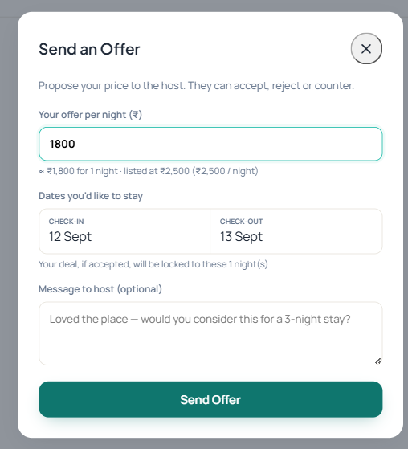

*₹1,800 against a stay that costs ₹2,500 these nights. The dialog names that figure while the guest is typing, so nobody argues against the wrong number.*

*The answer, immediately. It thanks the guest, says plainly that the offer is under what these dates go for, names a price they can actually take, and names the next step. It never sounds automated, and it never claims the host has been asked.*

Note the third line: **"Not sure yet? It will be waiting in My Negotiations."**
Before this, a guest who dismissed this panel had no route back to their own
offer.

---

## 4. Scenario 2 — At or above the accept line

**Taken on the spot, at the price the guest named.** The host is informed;
nothing is asked of them.

*₹2,400 — under what the nights cost, over the host's target.*

*Accepted at ₹2,400 — the price the guest offered, not the ideal and not the list price. The code carries that rate into checkout.*

> **The wording here was changed on the client's instruction.** It used to read
> "That is at or above what the host will take." That is both the wrong tone and
> a leak: it tells a guest where the accept line sits relative to their own
> offer, which is a fact about the host's target. It now says only that the host
> agreed and the booking can go ahead.

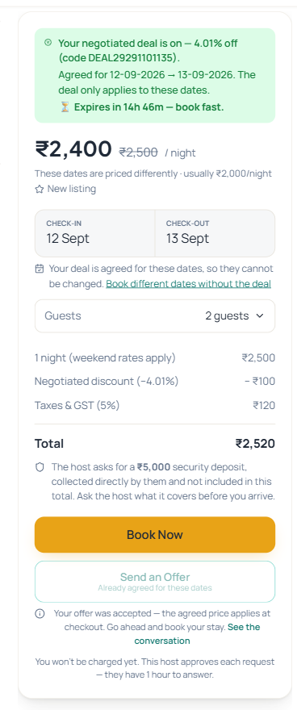

_The rail updates itself: the agreed rate against the struck-through **₹2,500** these nights actually cost, the discount as a line item, tax on the discounted amount, and the total payable. It says which nights the deal covers and when it expires._

### What the host is told

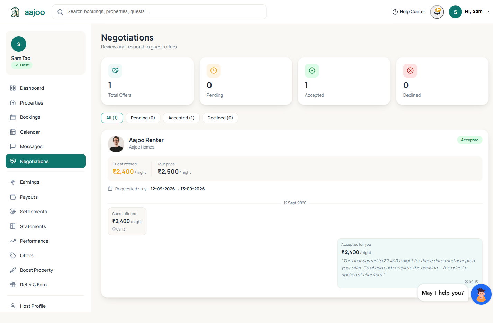

_The host's own screen. "Guest offered ₹2,400 — Your price ₹2,500", so the offer reads as what it is: ₹100 under the asking price for those nights. The platform's acceptance is written into the thread and labelled **"Accepted for you"**, so a host can always tell which words in their own conversation are theirs._

---

## 5. Every offer has an answer under it

This is the change the client asked for most directly, and it is worth its own
section.

Until 12 September an automatically accepted offer wrote the guest's message
and nothing else. A renter who had negotiated six times saw six of their own
offers in a column with nothing between them — a monologue, not a negotiation —
even though every one of them had been accepted.

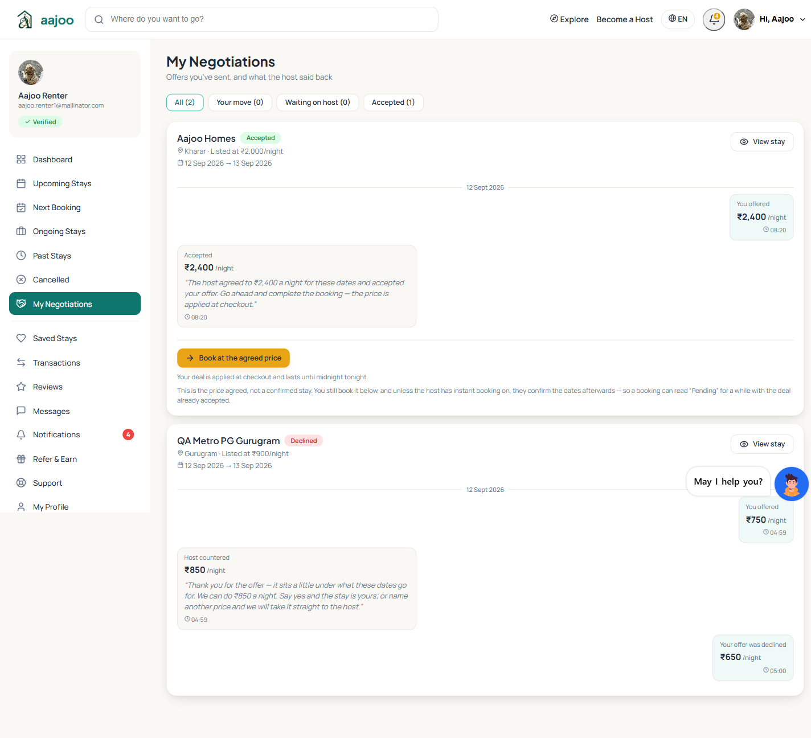

*Every message now carries an answer and a label saying what became of it. "You offered ₹2,400", then "Accepted ₹2,400" in the host's name, then the button that takes the agreed price to checkout.*

The labels themselves were wrong in a second way. A status describes what
happened **to** a message, not what its sender did — the person who acts on an
offer is always the other side from the person who sent it. At the end of a real
thread a renter who had been declined by the host was reading **"You declined
₹650"** on their own screen. One shared rule now labels the guest's web screen,
the host's web screen and the app.

---

## 6. Why the minimum cannot be found

This is the scenario that protects the host's floor.

A guest hunting for the minimum would look for the point where the platform's
behaviour changes. **There is no such point.** Here are three offers on the same
listing and the same nights — one below the ₹2,000 floor, one exactly on it, one
above it. Each was sent as the opening offer of its own negotiation.

| The offer, as it was typed | Which side of the floor | The answer that came back |
|---|---|---|
|  | **₹1,990** — under the floor | 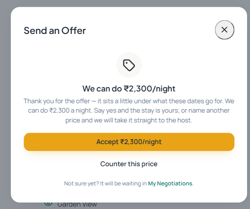 |
| 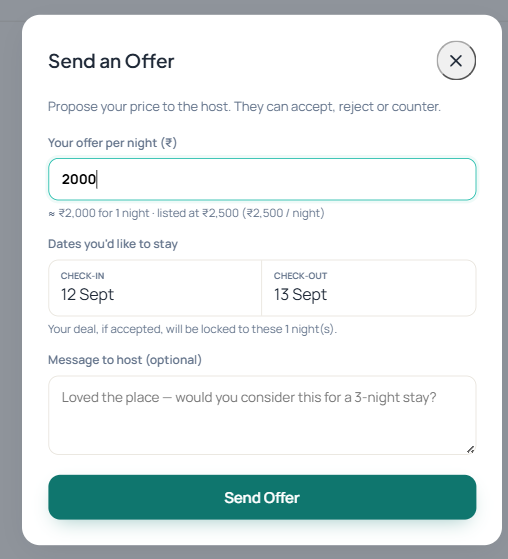 | **₹2,000** — exactly the floor |  |
|  | **₹2,010** — above the floor |  |

> **The three answers are the same photograph.** Not similar — identical. The
> three PNG files in the right-hand column are byte-for-byte the same file
> (MD5 `21dc27ad…`), because the same pixels came back all three times.
>
> The answer is calculated from the ideal and the list price. The minimum is not
> in the arithmetic at all, so no offer's answer moves when the minimum moves —
> and a guest lowballing twice learns nothing the first attempt did not already
> tell them.
>
> The floor is not merely hidden. **There is no question a guest can ask that
> finds it.**

Two supporting rules hold this in place:

- **The host's "reject below" and "auto-accept above" settings were removed
  from the wizard**, because a reject line is only useful to a guest if the
  refusal quotes it — and quoting it hands out a private number. The host keeps
  the same power without the leak: every counter-back reaches them and they
  decline it themselves.
- **The offer ceiling is the only number the engine will ever quote back**, and
  it is the price already printed on the page.

---

## 7. Scenario 3 — A price already agreed bars another negotiation

Once a price has been agreed for particular nights there is nothing left to
negotiate for those nights. The guest books, or they do not.

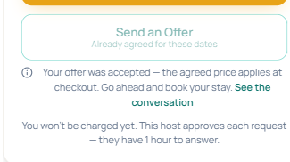

_"Send an Offer" is greyed and says why — **"Already agreed for these dates"** — with the sentence underneath pointing at the two things a guest can actually do: book at the agreed price, or open the conversation._

**Scoped to the nights, not to the listing.** A guest who agreed a price for
this weekend may still negotiate next weekend on the same property. The rail's
own line says so: *"Your deal is agreed for these dates, so they cannot be
changed. Book different dates without the deal."*

---

## 8. Scenario 4 — The guest argues back

**This is the only point at which a host is interrupted.**

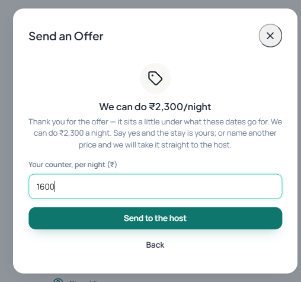

*The guest names a different price. It must be below the answer they were given — a guest trying to "counter" at or above it is told to simply accept instead.*

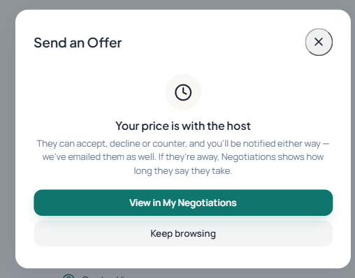

*The guest is told plainly where their price has gone, that the host has been emailed as well as notified, and that Negotiations will show how long this host says they take to reply.*

**There is no longer a limit on the rounds.** The old engine allowed three
offers per guest per stay and then closed the thread, which ended arguments the
host was still willing to have. A thread now runs until somebody settles it:
accepted, declined, or expired.

### The host's side

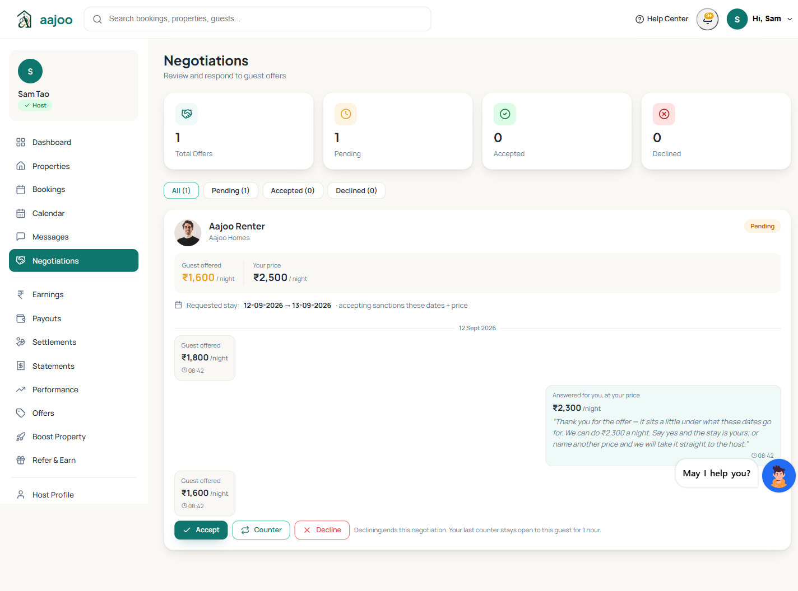

_The whole exchange in order: the guest's ₹1,800, the ₹2,300 sent on the host's behalf — labelled **"Answered for you, at your price"** so the host knows it was not their typing — and the guest's ₹1,600 now awaiting a decision. Accept, Counter and Decline, with the consequence of the third spelled out beside it: **"Declining ends this negotiation. Your last counter stays open to this guest for 1 hour."**_

---

## 9. Scenario 5 — The host declines

A decline used to be a dead end: the thread closed and the guest was left with
nothing, while the host's last number — one they had been willing to take
moments earlier — went in the bin.

### What the guest sees, without touching anything

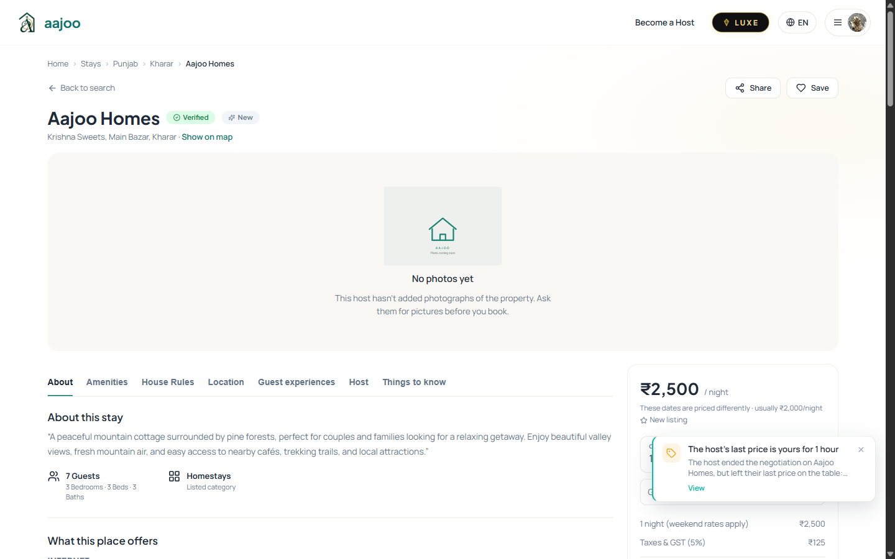

*The guest was reading the listing. The host clicked Decline in another browser, and this arrived — no reload, no refresh, no navigating to a dashboard.*

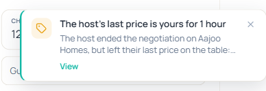

*Clicking it opens the negotiation it is about.*

### The price the host left behind

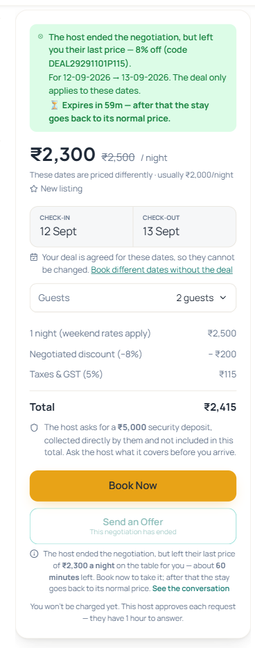

_The rail now prices the stay at the host's last counter, **₹2,300** — against the ₹2,500 these nights cost — with the discount as a line item and the total payable. The banner says what it is, which nights it covers, and how long is left. "Send an Offer" is greyed with **"This negotiation has ended"**, and the sentence beneath it says the rest: the host's last price, the minutes remaining, and a link into the conversation._

The parting price is a personal, date-locked discount code. It is:

- **the host's own last number**, never a figure the platform invented;
- **locked to those exact nights**, so it cannot be carried to a cheaper stay;
- **valid for one hour**, counted down on the page and in the notification;
- **single use**, and it dies with the hour whether or not it is used.

### The negotiation is over for the day

That guest cannot open another negotiation on that listing until midnight IST.
Without this, removing the round limit left a door wide open: a decline ends a
negotiation, so the very next offer would have started a fresh one with a clean
count, and a guest could have re-opened the same argument a second later, for
ever.

Measured in **IST days, not rolling hours** — declined at 9am and you are free
again at midnight; declined at 11pm and you are free in an hour. It is a rule a
person can hold in their head.

### Both records

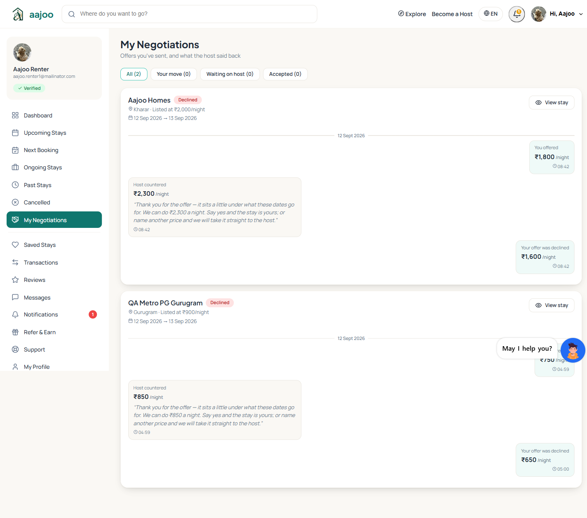

_The guest's thread: their ₹1,800, the ₹2,300 answer, and their ₹1,600 marked **"Your offer was declined"** — not "You declined"._

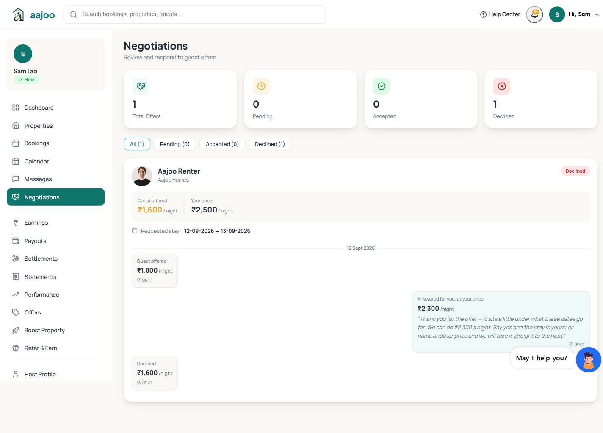

*The same conversation from the host's side, with the platform's words marked as such and the outcome on the card.*

---

## 10. Every notification says so

The client's report was that a notification *"just goes and sits silently in the
notification icon"*. Three things now happen for every notification, on the web
and on the app.

### A popup, on whatever screen you are on

Shown in section 9. It appears without a reload, on any page including public
ones, and clicking it lands on the thing it is about — resolved by the same
function the bell and the notifications list use, so a popup can never open
Bookings for something whose bell entry opens Negotiations.

### A record

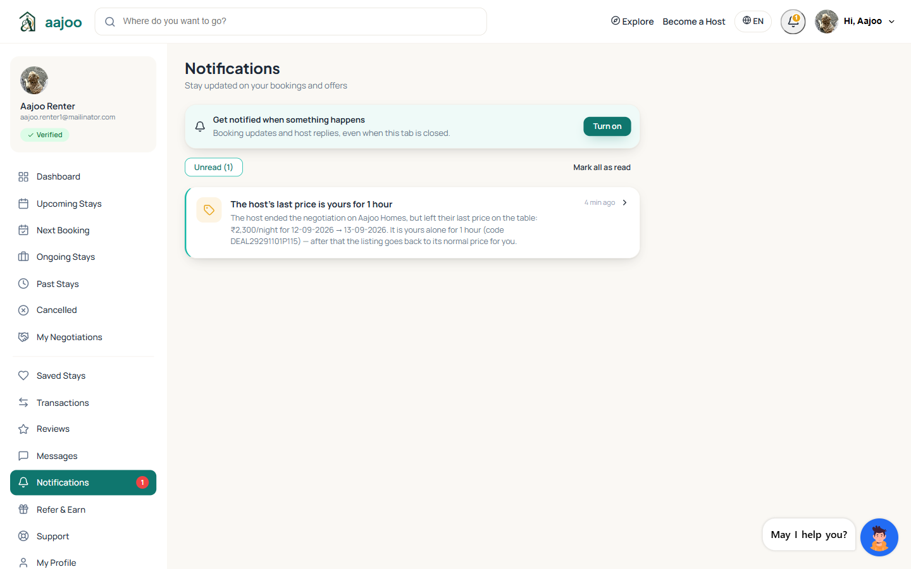

*The same event in the guest's list, carrying the figure, the nights, the code and the deadline.*

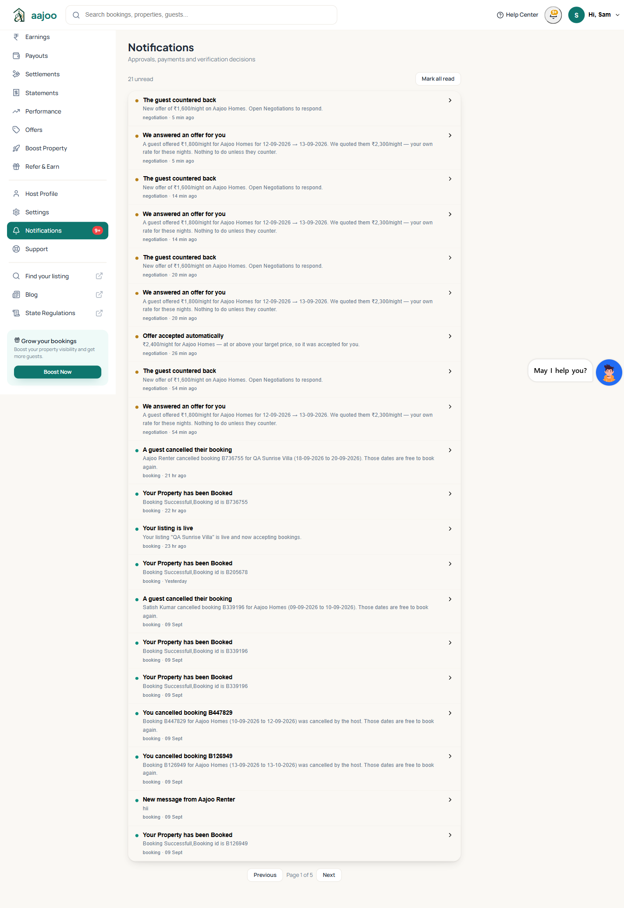

_The host's feed for the same run: the offer answered on their behalf, the guest's counter-back, and — for the accepted case — "Offer accepted automatically". **The host is told of every outcome and asked about only the one that needs them.**_

### An email

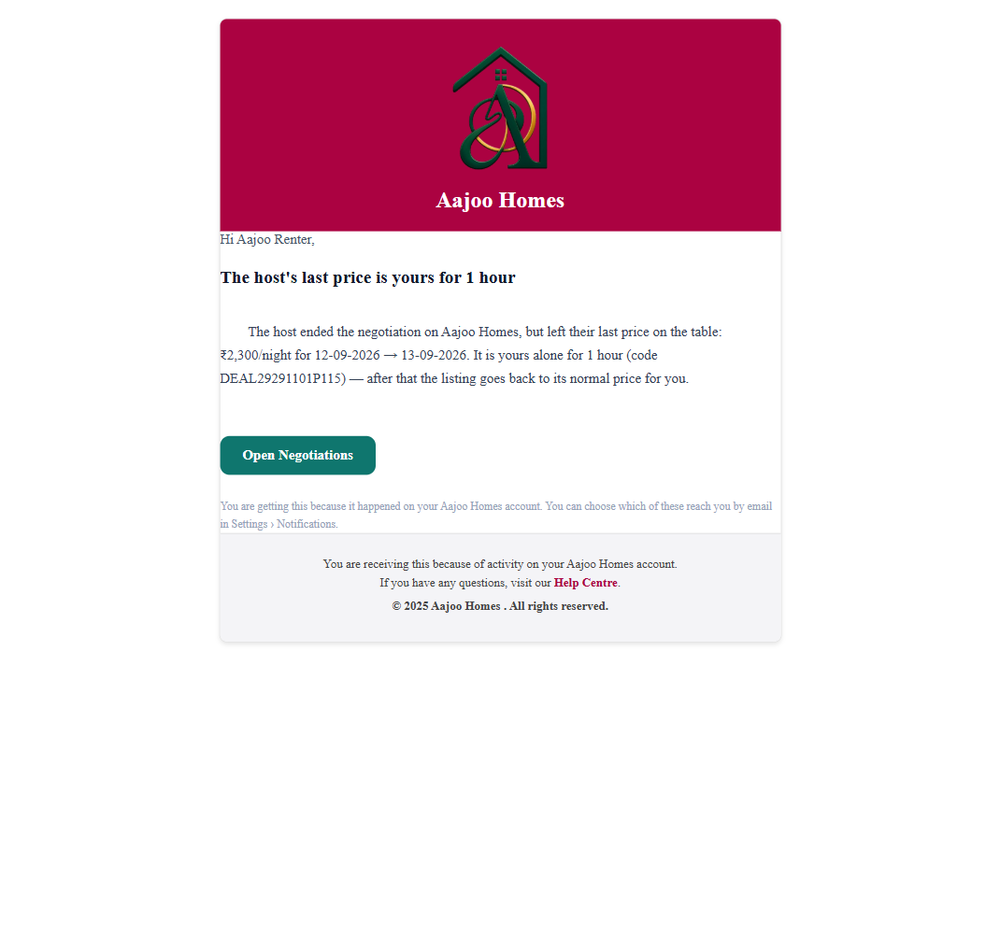

*The same notification, delivered to the guest's mailbox, with a button that opens the negotiation.*

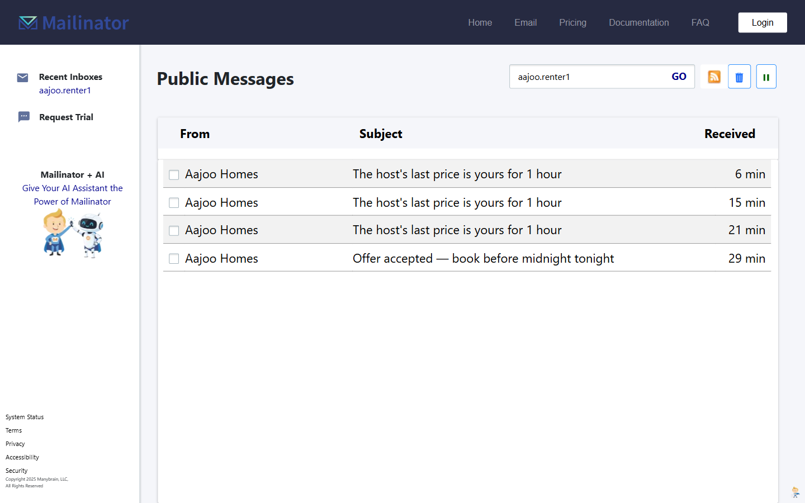

*The test renter's mailbox during this run. Before 12 September the host-offer email selected a database column that does not exist and threw on every single offer, in silence — a host was never emailed about an offer, ever.*

**What is not emailed:** ordinary chat messages, and payment receipts. A chat
that emails every line is a chat nobody reads, and a receipt already arrives as
an invoice. Everything else does.

### And a guest can change it

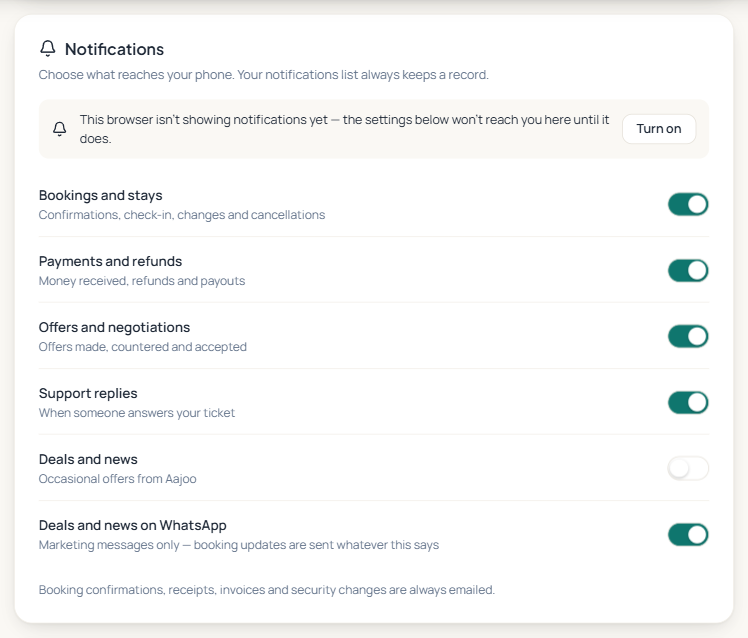

*One switch per category, governing both interrupting channels — the phone and the mailbox. Receipts, invoices, confirmations and security changes are sent whatever these say, and the screen states that rather than showing a dead toggle.*

---

## 11. Scenario 6 — An offer above what the nights cost

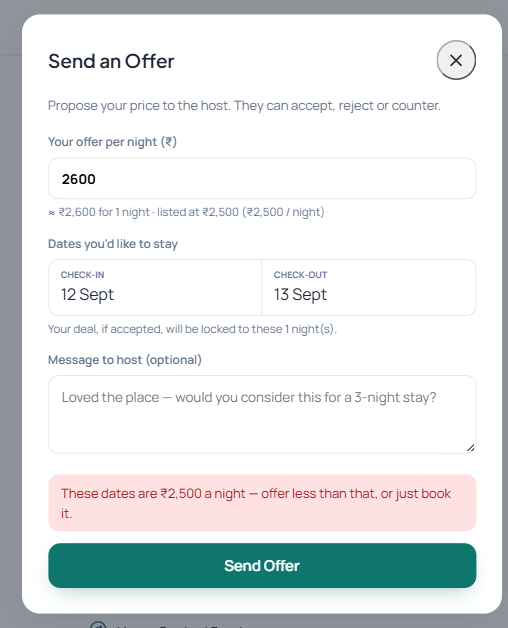

_There is nothing to negotiate above the price already on the page. The refusal names the figure for **these dates** — ₹2,500 — not the listing's ordinary nightly rate, and the guest is pointed at Book Now instead._

This was a real defect until 12 September. The check used the flat nightly
column while the offer was judged against the dates chosen, so on a listing with
weekend pricing an offer that should have been accepted on the spot came back
"this stay lists at ₹2,000/night". Both clients and the server made the same
mistake independently, and neither could see the other's copy of it.

---

## 12. Scenario 7 — A stay starting tomorrow

Negotiation applies to stays **starting today**. A stay starting tomorrow or
later is an **advance booking**: it goes at the listed price, reservable with
10% now and the balance before check-in.

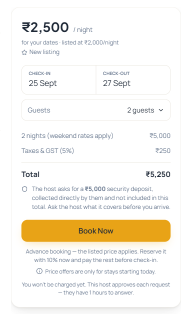

*Two sentences, not one refusal: what applies instead, and why the price will not move. The offer button is not simply dead.*

---

## 13. A greyed-out day says why it is grey

Reported from the live site during this rebuild: *"until I selected 12 every
date was available; when I clicked 12 it greyed out 13 too."*

The calendar was right — that listing asks for a minimum of two nights, so a
check-in on the 12th cannot check out on the 13th. Nothing said so, and a date
that disappears the moment you act reads as a bug rather than a rule.

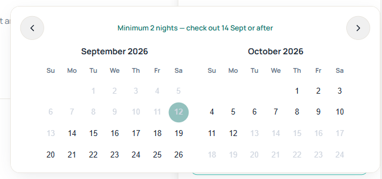

*The minimum stay and the earliest checkout, pinned to the top of the panel where they stay on screen whatever the height. The barred day also explains itself on hover, which every other kind of barred day already did.*

Two layout faults were fixed with it: the two months wrapped and stacked at the
panel's width, doubling its height and pushing **Done** off the bottom of the
screen, and the panel was sized against the window rather than against the room
below it.

---

## 14. What protects the host

| Protection | How it works |
|---|---|
| The minimum never leaks | The answer is calculated from the ideal and the list price. The minimum is not in the arithmetic, so no offer's answer moves when it moves — demonstrated in section 6 |
| No automatic answer is worth less than an acceptance | Every one sits at or above the ideal, for those nights |
| A lowball is never rewarded | The lower the offer, the closer to the screen price the answer comes back |
| The host is never interrupted needlessly | Round one is answered by the platform; only a guest who argues reaches a person |
| The host always knows what was done for them | Every automatic acceptance and every answer sent on their behalf is reported, and marked as automatic on their own screen |
| A decline actually ends it | The thread closes, and that guest cannot re-open one on that listing until midnight |
| …but a decline still sells the room | The host's last number stays on the table for an hour, locked to those nights |
| A deal cannot drift | An agreed price is locked to the exact nights it was agreed for, and expires |
| Nothing is sold below the target without the host | The platform never accepts a below-ideal price on the host's behalf. Only the host can |

---

## 15. What changed since 9 September

| | Then | Now |
|---|---|---|
| Rounds | Three offers per guest per stay, then the thread closed | No limit. A thread runs until it is settled |
| An automatic acceptance | Wrote the guest's message and no answer, so accepted offers read as a column of unanswered messages | Writes both sides, labelled "Accepted for you" on the host's screen |
| Message labels | By direction alone — "You declined ₹650" on the screen of the person who had been declined | By what happened to the message. One rule, three screens |
| A decline | Thread closed, guest left with nothing | The host's last price for one hour, locked to those nights, and the day closed to further offers |
| A held deal | The offer button stayed live and the server refused the form afterwards | Greyed, with the reason and what to do instead |
| Prices | The flat nightly column, while the offer was judged against the dates | Everything is the figure for the nights being argued over |
| Notifications | Sat silently in the bell, which only moved on a 60-second poll | A popup on any screen, an email, and a push — the instant it happens |
| Emails about offers | Selected a column that does not exist; threw on every offer, in silence | Sent, and read at the address the account actually uses |
| The acceptance wording | "That is at or above what the host will take" | Says the host agreed and the booking can go ahead — nothing about where the line sits |

---

## 16. What we would like you to confirm

1. **The ladder** — accepted at or above the ideal; answered automatically
   between the ideal and the list price; a person only from round two.
2. **The one-hour parting price** after a decline, and that it is the host's own
   last counter rather than a figure we choose.
3. **The same-day lockout** — one decline closes that listing to that guest
   until midnight IST.
4. **Unlimited rounds.** The alternative is a cap, which ends arguments the host
   may still want to have. **We recommend leaving it uncapped.**
5. **Which notifications are emailed** — everything except ordinary chat
   messages and payment receipts.

Once these are confirmed we will close the module.

---

*Every screenshot in this document was taken on www.aajoohomes.com on
12 September 2026, driving the live flow against a live listing with a real
guest account and a real host account. The test records created for these
photographs have been removed.*
