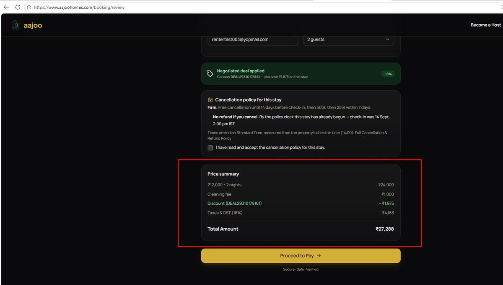
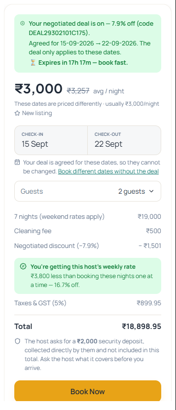
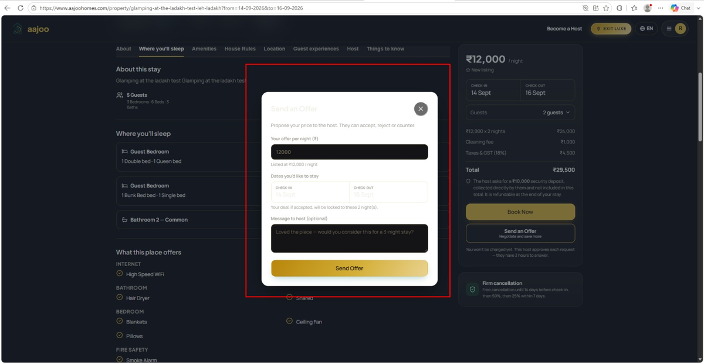
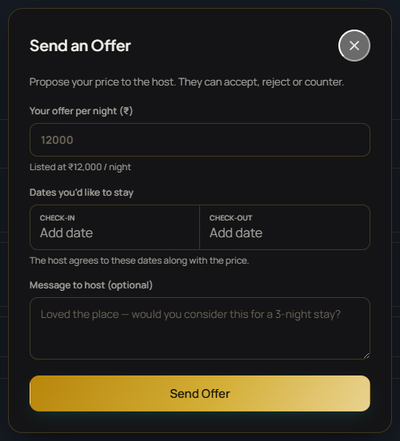
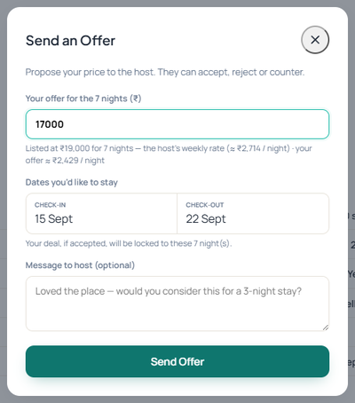
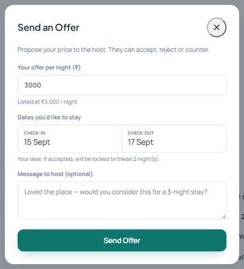
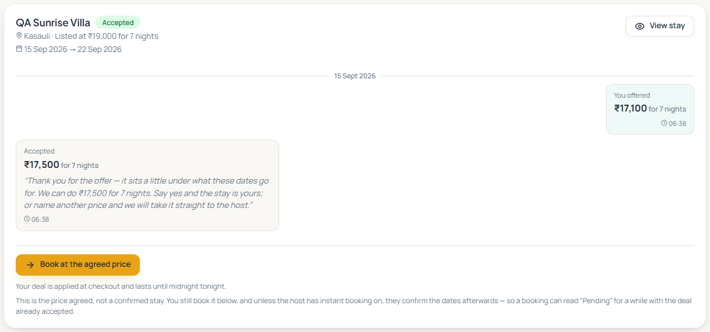
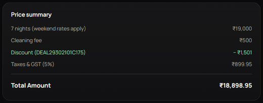
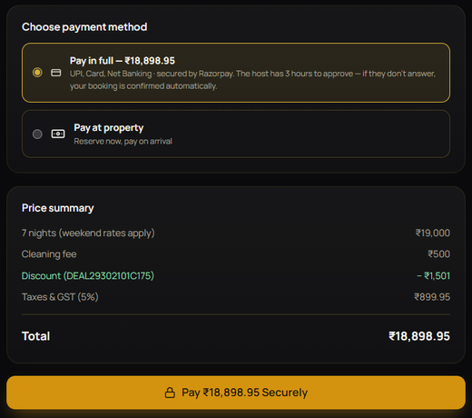
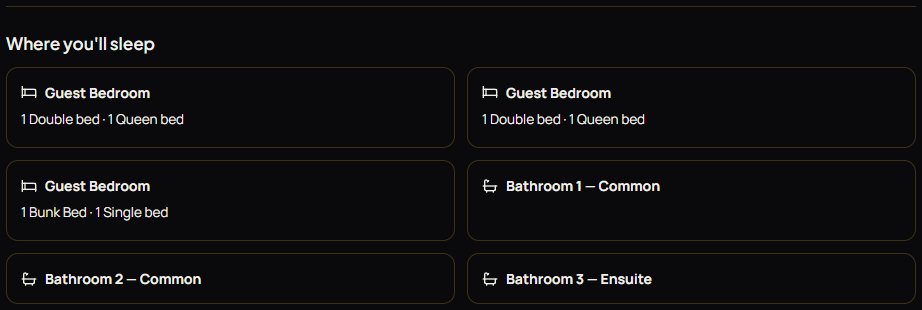

# Client Reports 13–15 September — Defects, Fixes and Verification

## 1. What this document is

Between the evening of 13 September and the morning of 15 September the client sent, by screenshot and message, **twenty-six items** — defects, questions and product asks — across the website, the Android app and the backend. This document takes each one in turn and says, in plain terms: what was seen, what was actually wrong, what was changed, how it works on the backend now, and how it was verified.

Every fix here is **live on the website and the backend** as of 15 September, 06:45 IST. The Android app changes are committed and ship with the **next tester build**; build 89, which is currently in circulation, does not carry them (§9).

> **How to read the verification column.** *tested* = a permanent automated test now pins the rule; *live* = walked on www.aajoohomes.com against the production backend on 15 September, with a photograph in this document; *not verified* = the fix is deployed and tested but the exact screen the client saw needs a signed-in session or a device we do not have.

### 1.1 Summary table

| # | Client report | Platform | Root cause, in one line | Status |
|---|---|---|---|---|
| 1 | "It should be 27376 not 26196" — the same stay priced three ways | Web · Backend · App | A coupon was a percentage of **three different bases** on three screens | Fixed · tested · live |
| 2 | "Cleaning fee is excluded here but showing charged" | Web | Under a deal the property card forgot the fees in its total while still printing the cleaning line | Fixed · tested · live |
| 3 | "Discount showing different on different pages" | Web | 7.5% printed as "−8%" on the review badge, "−7.5%" on the card | Fixed · tested · live |
| 4 | "During payment the price is again different" | Web | Page rounded to the rupee, Razorpay showed paise (₹27,288 vs ₹27,287.50) | Fixed · tested · live |
| 5 | "Pls correct this LUXE UI, it is not readable" | Web | The dialog was a literal white card with near-white text | Fixed · tested · live |
| 6 | "Cleaning and all is on demand right, so we don't have to charge that fee" | — | **Decision needed** — reverses the 10 Sep spec (C18) | Open — client |
| 7 | "For weekly and monthly [negotiation] should be on the total" | Web · Backend · App | The dialog asked per night on a seven-night stay | Built · tested · live |
| 8 | Amount differs after pay-at-property | Web | Stay card showed the room subtotal, not the charged total | Fixed · tested |
| 9 | Messages arrive but popups don't | Web | Live channel failed silently; popup sat behind the mobile tab bar | Fixed · tested · not reproduced |
| 10 | "Balance received" on a stay paid once | Backend | Wording keyed on a status, not on whether money had arrived before | Fixed · tested |
| 11 | Typing "nainital" finds nothing | App | Gazetteer holds "Naini Tāl"; the filter compared raw characters | Fixed · tested |
| 12 | "Fix the highlighted fields" with none highlighted | Web | Validation ran against a stale field that no longer renders (my regression) | Fixed · tested |
| 13 | Map cannot zoom or drop a pin | Web · App | Google's default gesture mode on touch is "two fingers"; app had no zoom buttons | Fixed · tested |
| 14 | GST differs between browse and booking (9.68% vs 18%) | Web | Review page banded the average night instead of each night | Fixed · tested |
| 15 | "Another guest" cannot be selected | Web | It could — nothing said it had been | Fixed · tested |
| 16 | Why ask reply time on fixed-price instant-book? | Web · Backend · App | It was required unconditionally; nothing reads it in that case | Fixed · tested |
| 17 | Icons on the category chips | Web · App | Two renderers; one never looked an icon up | Built · tested |
| 18 | Bedroom / bed / bathroom classes | Web · Backend · App | Three integers could not say which room, which bed, whose bathroom | Built · tested · live |
| 19 | Emergency distances from Google in Things to know | Backend · Web · App | Hosts were asked to guess | Built · tested · live |
| 20 | Chat bubble sat on the Continue button | Web | The launcher overlapped the wizard's primary button on phones | Fixed |
| 21 | "Monthly rate as per 28 days?" | Web · App | Engine already used the calendar month; the helper text said 28 | Answered · copy fixed · tested |
| 22 | "How is GST 7.21%?" | Web · Backend | A blended average printed as if it were a rate | Answered · label fixed · tested |
| 23 | "Auto counter at ₹7,000 — correct?" | — | Explained: weekday/weekend blend, step toward the accept line | Answered |
| 24 | BotPenguin shows "NA" for app users | Backend · App · Web | App discarded the identity the server returned; email was never sent | Fixed · tested |
| 25 | Razorpay Payroll for host payouts? | — | Evaluated: not suitable; recommendation given | Answered |
| 26 | Found on the way: "0 km away", "1 Bunk Bed bed", a white "Pay at property" card, ₹900 over a .95 total | Backend · Web | Small, real, fixed the same day | Fixed · tested · live |

## 2. How a price is worked out now — one place to read it

The client's note said *"price is most important part of app"*. This is the whole rule, in order, and it is the same rule on the website, in the app and on the server. Every number in this document can be reproduced from it.

1. **Room subtotal.** Each night's list rate for the dates chosen (weekday, weekend, seasonal), replaced by the host's **weekly** rate at 7 nights or the **monthly** rate at a calendar month. For an advance booking the host's advance-booking discount comes off here.
2. **Discount — on the room only.** A negotiated deal (a `DEAL…` coupon), an admin coupon, or a running host offer is a percentage of step 1. **Never of the fees.**
3. **Fees, on top, undiscounted.** Extra-guest charge, pet fee, cleaning fee (per stay or per night as the host set it).
4. **GST, per night, on what is actually charged.** The payable amount (2 + 3) is split back across the nights in proportion to their list rates; each night's share under ₹7,500 is taxed at 5%, ₹7,500 and above at 18%; the tax is rounded **once**, on the sum. A stay whose nights straddle the line has two rates in it and is labelled that way ("6 nights at 5% · 1 night at 18%") rather than as a made-up average.
5. **Total** = 2 + 3 + 4. Printed to the paise wherever the gateway will show paise.

**The worked example the client sent** — listing 29310, ₹12,000 a night, ₹1,000 cleaning, 14–16 September, a deal struck at ₹11,100 a night (stored as 7.5%):

| Step | Amount |
|---|---|
| Room: 2 × ₹12,000 | ₹24,000 |
| Deal: 7.5% of the **room** | − ₹1,800 |
| Cleaning fee, undiscounted | + ₹1,000 |
| Taxable | ₹23,200 |
| GST: two nights of ₹11,600, both ≥ ₹7,500 → 18% | + ₹4,176 |
| **Total** | **₹27,376** |

That is the figure the client expected, and it is what every screen and the booking record now produce. The three figures they saw instead, and where each came from, are in §3.1.

## 3. The pricing batch (14 September, 23:30)

### 3.1 "It should be 27376 not 26196" — the same stay priced three ways

**What you saw.** Three totals for one stay: ₹26,196 on the property card, ₹27,288 on the review page (and in the booking record B476130), and a different figure again at payment.

*Client's screenshot: the review page charging ₹27,288 with a "−8%" badge*

**What was wrong.** One fault with three faces. The server mints a negotiated deal as a percentage of the stay's **room subtotal** — chosen so that the percentage reproduces the agreed per-night price exactly (₹11,100 × 2 = ₹22,200; 22,200 ÷ 24,000 = 7.5% off). That only works if the percentage is applied back to the same figure, and nobody applied it to the same figure:

| Screen | Took 7.5% of… | Result |
|---|---|---|
| Property card (web), under a deal | the room — but it had **dropped** the cleaning fee, the pets and the tax weights from its total while still printing the cleaning line | ₹26,196 |
| Review page (web) and `/booking/create` | room **+ cleaning** (₹25,000 → ₹1,875 off) | ₹27,288 |
| Property page (app) | room + extra-guest charge | — |
| What the host had agreed | the room, then the fees on top | **₹27,376** |

The host was being paid ₹23,125 for a room they had let for ₹23,200, and the guest was shown three numbers for one stay.

**What we changed.**

- **Backend** (`booking.controller`, `utils/couponApply.roomSubtotalFor`): the coupon base is `quote.subtotal` — the room — and the discount is taken off the whole price, so fees ride through untouched. The `/user/coupons/validate` preview endpoint no longer trusts whichever amount the client sends: it works the room subtotal out **from the stay itself** (property + dates) and answers with the base it used. Two clients sent two different amounts; now neither matters.
- **Website** (`bookingDraft.summarize`): the discount is a percentage of `roomSubtotal`, not of `chargeable`; a server-supplied absolute discount is capped at the room. The property card, under a deal, now builds its figures from the **server's own components** (room, fees, per-night tax weights) less the deal, so it is the same bill as an ordinary stay with one line taken off.
- **App** (`booking_pricing.priceStay`, `property_page`): the discount is clamped to the room; the coupon is previewed and applied against the server's room subtotal, not room + party.

**How it works on the backend now.** `POST /booking/create` recomputes the whole price from its own rate card (`quoteRange`), adds the fees it knows about, and refuses a client price more than a rupee away. If a coupon code is present it calls `validateAndPriceCoupon` with `amount = quote.subtotal`, subtracts the resulting discount from the full price, then taxes the remainder night by night (`taxForNights`). Nothing the client sends decides a discount.

**Verified.** Backend test `aCouponIsOnTheRoom` (1,800 not 1,875; 27,376 charged; the clamp and the validate endpoint read the room). Web test `aCouponIsOnTheRoom.test.mjs` (27,376 by percentage and by absolute; the card's deal path; fees outside the discount). App test `a_coupon_is_on_the_room_test.dart`. **Live** — a real weekly deal struck on 15 September (§4.1) shows the card, the review page and the payment page agreeing to the paise.

### 3.2 "Cleaning fee is excluded here but showing charged"

The property card, with a deal applied, printed "Cleaning fee ₹1,000" on its own line and a total of ₹26,196 that did not contain it. Its total came from a local fallback that knew only the room and the party charge; the cleaning line was read straight off the server's quote. Fixed as part of §3.1 — the card under a deal is now built from the server's components — and a negotiated stay without a server quote is flagged "indicative" like any other, rather than presented as exact.

*Live, 15 Sep: the property card under a weekly deal — ₹19,000 − ₹1,501 + ₹500 cleaning, GST ₹899.95, total ₹18,898.95*

### 3.3 "Discount showing different on different pages"

7.5% was printed as **−8%** on the review page's badge (rounded) and **−7.5%** on the card. A deal is stored to two decimals precisely so the guest is charged what the host agreed; rounding it where they can see it is not an improvement. One formatter (`pct()`) now prints the same digits everywhere on the web, and it prints the digits the app already did.

### 3.4 "During payment the price is again different"

₹27,287.50 was "₹27,288" on the page and "₹27,287.50" on the Razorpay sheet. Totals on the card, the review page, the payment page and the pay button are now printed **to the paise**, because that is the figure the gateway opens with. During the live walk on 15 September a second instance of the same class was caught — a tax line of "₹900" over a total ending in .95 — and the tax and discount lines now print to the paise too, so the lines add up to the total (§4.1).

### 3.5 "Pls correct this LUXE UI, it is not readable"

*Client's screenshot: the Send an Offer dialog in LUXE — white card, invisible title and dates*

The `.modal` rule said `background: #fff` while everything inside it uses the skin's ink colour, which in LUXE is near-white: 1.14:1 contrast. Same fault and same fix as the chat bubble earlier in the month — the surface token (`--surface-pop`), which resolves to white in the classic skin and to the LUXE card colour in LUXE, plus a gold hairline. Measured on the live page: `#141416` behind `#F2F0EA` text.

*Live, 15 Sep: the same dialog in LUXE*

The LUXE contrast test now also refuses a literal white `.modal`, and — after the payment page's "Pay at property" card was photographed white during the live walk — a literal white payment-method card.

### 3.6 "Cleaning and all is on demand… we just can show that host charges this" — decision needed

The same message asks for two different things. It says cleaning should be **shown, not charged**; it also says the stay "should be 27376", and ₹27,376 is the figure **with** the ₹1,000 cleaning fee in it (without it the stay is ₹26,196). Charging the fee is what the 10 September property-form specification asked for (item C18: a cleaning fee with a per-stay/per-night frequency), and it has been quoted, charged, taxed and paid to the host on every booking since.

So the arithmetic was made honest and the fee was left charged, pending a decision. **If "display only" is the answer**, it is one switch: the quote, the booking clamp and both clients stop adding `cleaningFee`, the property page states it the way the security deposit already is ("collected directly by the host, not included in this total"), and the frequency field in the wizard should be retired since it would then mean nothing. This is recorded as item 1.14 in the master task list.

## 4. Weekly and monthly negotiation on the total (15 September)

### 4.1 "For weekly and monthly it should be on the total"

**What you saw.** The Send an Offer dialog on a seven-night stay asking "Your offer per night (₹)" against "Listed at ₹12,000 / night".

**Why the client was right.** The negotiation engine already judged a dated offer against the stay's composite totals **divided back to per night** — so on a week the "per night" was a derived number (the ₹75,000 weekly rate on 29310 is ₹10,714.29 a night). Nobody thinks in that unit.

**The rule now, on all three platforms:**

| Stay | The conversation |
|---|---|
| under 7 nights | per night, exactly as before — "₹3,000/night" |
| 7 nights or more | the stay total — "₹75,000 for 7 nights — the host's weekly rate (≈ ₹10,714 / night)" |

**What deliberately did not change: the unit of record.** Every offer, counter, event and coupon still carries a per-night figure. A guest who types ₹70,000 for a week sends ₹10,000/night; a host who counters ₹1,00,000 sends ₹14,285.71 (the column is two-decimal); every screen multiplies back and rounds, which recovers the typed total exactly for any stay under a hundred nights. Changing the stored unit would have rewritten the ledger, the engine and the coupon arithmetic for a sentence's worth of difference.

**How it works on the backend.** One helper, `utils/negotiationUnit.js`, decides the unit from the stay length (the threshold is the same constant the weekly rate uses). Every sentence the server writes — the accept, the auto-counter, the refusal above list price, the expiry notice, the parting coupon, the host's email — takes its wording from it; every negotiation socket event now carries `nights` so the clients' live toasts can do the same. The engine's decision (accept at the host's target, counter below it, escalate under the floor) is untouched.

**On the website:** the dialog's label, placeholder and "Listed at" line; the ceiling check (total against total on a long stay); the counter-back; the outcome lines; the counter dialog; both Negotiations pages and the transcript. **In the app:** the offer sheet (now handed the stay's list total), the guest and host negotiation screens, the host home card.

*Live, 15 Sep: a seven-night stay on the QA listing asks for a total against the weekly rate*

*Live, 15 Sep: two nights on the same listing — per night, as before*

**Walked end to end on the live site, 15 September 06:38.** A real offer of ₹17,100 for seven nights on the QA listing (weekly rate ₹19,000, ₹500 cleaning, weekend nights, 5% GST). The platform countered ₹17,500 for 7 nights; the counter was accepted; the deal coupon was minted at 7.9%; and the card, the review page and the payment page all read **₹19,000 − ₹1,501 + ₹500 + ₹899.95 = ₹18,898.95**. Nothing was paid.

*The counter, in the stay's unit*

*The deal on the guest's My Negotiations page — listed, offered and accepted as totals; the older per-night threads unchanged*

*The review page's price summary*

*The payment page: the same total, the same paise, and the "Pay at property" card now themed*

**Verified.** Backend `aWeekIsNegotiatedAsATotal` (threshold = the weekly rate's; round trip for every total; the coupon never lands above the typed total; every sentence uses the helper). Web `aWeekIsNegotiatedAsATotal.test.mjs`. App `a_week_is_negotiated_as_a_total_test.dart`. Three older tests that pinned the per-night sentences were updated, not deleted.

## 5. The 13 September batches

### 5.1 Money and notifications (13 September, 12:30)

**Amount differs after pay-at-property (8).** The upcoming-stay card printed `book_price` — the room subtotal, before tax and discount. Booking B115781: `book_price` 2,099.75, `book_total_amt` 2,204.74, paid 2,204.74. The card understated every stay by its tax. The card now prints `book_total_amt`, the ongoing-stay hook carries a total for the first time, and the rule is pinned: *a headline shown to a guest is always tax-inclusive.* The app was never wrong here.

**Popups not appearing (9).** Reported as "messages arrive but popups don't". **Not reproduced.** The server emits, the socket rooms match, and the transport reaches the production host. What was wrong is that when the live channel failed it failed **invisibly**: a missing token was permanent, and a refused handshake was silent. Both now retry and report their state (`liveState()`), and the popup — which asked for the bottom-right corner, where the mobile tab bar and the chat bubble live — sits top-centre on phones. This may be the whole story; only the client's own phone can confirm it.

**"Balance received" on a stay paid once (10).** A guest who booked pay-at-property and then paid in full online was sent a receipt for a second instalment. The wording keyed on a *status* (`!firstPayment`) rather than on whether money had arrived before, which `book_amount_paid` records. Fixed in the guest notification, the host notification and the booking history.

### 5.2 Five reports, "working fine earlier and now breaking" (13 September, 23:50)

The client's covering note was that these had broken "out of nowhere". That was true of exactly one of the five; the rest were long-standing and were simply met for the first time. Saying which is which matters.

**"Fix the highlighted fields" with nothing highlighted (12) — this one was mine.** Introduced the same day by the per-room work: Beds became a derived read-out once a room named a bed, and the form stopped writing the field the validator read, so a host who typed 3 and then described five bedrooms failed "5 bedrooms need at least 5 beds" against a stale 3 — attached to a field that no longer renders and therefore could not turn red. Validation now reads the number the screen shows, and there is a guard for the class: when an error has nowhere to land, the toast says the *message* instead of "fix the highlighted fields".

**Typing "nainital" finds nothing (11).** The city picker's data is a transliterated gazetteer that really holds "Naini Tāl" and "Dehra Dūn", and every filter compared raw characters. A folding table was **generated from that asset** (276 non-ASCII characters, 170 folding to one Latin letter) and used for comparison only — the label still reads "Naini Tāl". It deliberately does not strip scripts it cannot fold: deleting Devanagari leaves an empty needle that matches everything.

**Map cannot zoom or drop a pin (13).** The location picker set no gesture mode, so on touch it ran Google's default — one finger scrolls the page and the map says "use two fingers" — which is right for a map inside an article and wrong for a component whose whole job is to be dragged. `greedy` on the picker only, plus zoom buttons, on web and app. The display maps on scrolling pages keep the default.

**GST differs between browse and booking (14).** The property page asks the server's quote, which bands **each night** on its own share; the review page had one number and banded the **average** night — ₹7,666 on that stay, just over the line, 18% on everything: ₹27,140 against ₹25,226, one screen apart. The server's per-night weights now travel with the draft and the review page splits the taxable amount across them. Verified against the server's own tax function: both sides now give 2,226.40 and 9.68%; the old path gives exactly the ₹4,140 in the screenshot.

**"Another guest" cannot be selected (15).** It could — the click set state, the id reached the payload, the server checked it belonged to the account. What it never did was *look* like it had: after picking a traveller the form asked for a name, phone and email with nothing saying those were the booker's. The picker now reports who was chosen and the contact block says whose details it wants.

### 5.3 The listing form (13 September, evening)

**Icons on the category chips (17).** Amenity chips carried icons; the category questions (Homestay Type, Local Experience, Shared Spaces) did not — two different renderers, one of which never looked an icon up. A third lookup, keyed by field *and* value, because these labels ("Private", "Shared", "Open") mean something only under their own question. A question draws icons on all of its chips or none. The app had no icon on any wizard chip and now has them all.

**Bedroom / bed / bathroom classes (18).** The client chose per-room detail. *The count drives the list*: type 3 in Bedrooms and you get three cards, no Add and no Remove, because a list that can grow independently of the number produces a listing that advertises two different properties. Enforced on the **server** (`utils/propertyRooms.js` writes exactly the counted rows, padding and truncating), because a rule enforced in one client is a rule the other breaks. Beds are derived from the rooms when any room names a bed; otherwise the host's number stands, so nothing saved before this was overwritten with 0. New table `property_rooms`, migration applied to the live database. Guests get "Where you'll sleep" on both platforms, from lines the server writes.

*Live, 15 Sep: "Where you'll sleep" on 29310*

**Emergency distances from Google (19).** Measured from the pin rather than asked of the host. The nearby lookup ranks by how many people have rated a place — right for "what is worth seeing", wrong here (it returns the district headquarters, not the outpost at the end of the road) — so this asks wide and re-sorts by **distance**. `fire_station` was missing from the platform's place types altogether. Suggested, never imposed: only empty boxes are filled. Straight-line, so the guest line says "nearest" and never "X minutes".

**Chat bubble on the Continue button (20).** Lifted above the wizard's primary button rather than hidden — this is the longest form on the platform and the place a host most wants help.

### 5.4 "Why ask reply time on a fixed-price instant-book listing?" (16)

Every consumer of the host's reply time was traced; each is gated on negotiation being on or on approval being required, so on a fixed-price instant-book listing the answer is read by nothing. It is now required only when negotiation is allowed **or** the host approves each request, on web, app and server; the stored answer is preserved when a host switches modes (passing null would have deleted it). The old test that pinned the blanket rule was inverted, not deleted.

## 6. Questions answered

**"Monthly rate as per 28 days?" (21).** The engine has used the **calendar month** since 5 September — 31 nights in January, 28 in February, 29 in a leap year, with the century rule right (2100 is not a leap year). The 28 is only a fallback for a caller with no date. What was wrong was the sentence under the field, which said "for 28 nights" and multiplied by 28; it now names the calendar behaviour on both clients, and a test pins the arithmetic so the copy cannot outlive it.

**"How is GST 7.21%?" (22).** The rule is exactly what the client said — under ₹7,500 a night 5%, ₹7,500 and above 18%, per night. That week (₹45,000 weekly + ₹500 cleaning) had six nights whose share came under ₹7,500 and a Sunday whose share came to ₹7,726; ₹3,279 on ₹45,500 is 7.21%. So 7.21% was a **division, not a rate**, and printing it where a rate belongs invited the question. The line now names the bands: "6 nights at 5% · 1 night at 18%".

**"Auto-counter at ₹7,000 — correct?" (23).** Yes, and the ₹7,000 was a coincidence with the base price. The stay mixed weekday and weekend nights, so the accept line and the ceiling were blends of the two tiers; a below-target offer draws a counter that steps from the ceiling toward the accept line by how close the offer came, rounded to ₹50. On those dates that step landed on ₹7,000.

**Razorpay Payroll for host payouts (25).** Since 31 July 2025 the Payroll wallet only pays individuals with personal PANs under TDS section 194J or no TDS; vendor and business-PAN payments were discontinued. Host payouts are marketplace payments under **194-O** (0.1%), which Payroll cannot file. Razorpay Route is the product built for this but needs ₹40L turnover and a transparency approval. Recommendation: a manual bulk-upload rail now (export queued payouts as a bank CSV, record the UTR), Route when eligible, not Payroll.

## 7. BotPenguin: "NA" for app users (24)

The chat-bot's Inbox showed name, phone and email as "NA" for app users. The app was opening the chat with whatever it had in memory locally and discarding the identity the server's handoff endpoint returned; and that endpoint never returned an email, because the platform's user table has no email column (it lives on the credentials table). The endpoint now returns name, phone **and email**, and both clients prefer the server's answer over their own state. Pinned by `botHandoff` on the backend and `support_chat_handoff_test` in the app.

## 8. Found on the way, 15 September

Small, real, fixed the same day, each with a test:

- **"Nearest police station — 0 km away", three times** under Things to know on 29310. A blank attribute went through `Number()`, and `Number(null)` is 0 — the same trap the lookup side had already closed. A blank is absent now, and 0 is not a distance.
- **"1 Bunk Bed bed."** The noun was appended to every bed label; "Bunk Bed" and "Sofa Bed" already carry it, and a crib is not a bed. "1 Bunk Bed", "2 Floor Mattresses".
- **A white "Pay at property" card in LUXE** on the payment page, photographed during the live walk (§4.1). Themed like every other surface.
- **"₹900" over a total ending in .95.** Tax and discount lines now print to the paise, so the lines add up to the total on every screen.
- **The app's chat negotiation page booked on its own** — per-night price × GST, for tonight, with no coupon and no fees; taxed twice and refused by the server's price check anyway. Its booking buttons now open the listing with the deal, the way the Negotiations screen already did.

## 9. Test and edge-case run, 15 September

### 9.1 The suites

| Repository | What ran | Result |
|---|---|---|
| Backend (`aajaoBackend-render`) | 141 test files, 1,014 assertions; syntax check over 763 files | **141/141 pass** |
| Website (`aajao-frontend-vercel`) | 43 rule-test files, 258 assertions; `tsc -b`; a real `npm run build` | **43/43 pass**, types clean, build clean |
| Android app (`aajoo_app_2026`) | 459 tests; `flutter analyze` | **459/459 pass**, 0 analyzer errors (427 pre-existing style infos) |

### 9.2 Edge cases exercised beyond the suites

A separate sweep ran the pricing and negotiation helpers of the backend and the website against corners the suites do not enumerate. **37/37 pass.**

| Area | Cases |
|---|---|
| Coupon on the room | 10% of a ₹24,000 room is ₹2,400 with cleaning never entering; the reported 7.5% deal on its own dates; the same deal refused on other dates; a one-night room; minimum spend judged on the room (₹4,999 refused, ₹5,000 accepted); a cap clamps a percentage; a flat coupon; 100% off leaves zero, never negative; expired / used / another account / another property each refused with their own sentence; unknown and empty codes; paise survive (7.5% of ₹23,333 = ₹1,749.98) |
| GST per night | ₹7,500 exactly is 18%; ₹7,499.99 is 5%; the reported stay taxes ₹4,176; a coupon can move a night across the line (2 × ₹7,600 at 7.5% off → 5%); a mixed stay is banded per night, not on the average; rounded once on the sum; no night breakdown still yields one defensible band; zero amount is zero tax, no NaN |
| Negotiation unit | 6 nights per night; 7, 8, 14, 28, 30, 31 as a total; the round trip holds for every total 1…2,00,000 (step 997) and every stay 7…62 nights; all three phrasings; nights from either date format, same-day, reversed, garbage, Date objects; zero nights |
| Rooms follow the count | 5 described rooms truncated to 3, 1 padded to 3; zero and negative counts; beds derived only when a room names one; duplicate bed types merge; an unknown bed type is dropped and an unknown room type is described generically, never as a slug |
| Website | 27,376 by percentage and by the server's absolute; 29,500 with no coupon and every line in the total; per-night cleaning outside the discount; a coupon that moves a night across ₹7,500 is banded on the discounted share; a stay with no weights bands on the average; `pct()` and `inrExact()` formatting; the typed figure read in the stay's unit for 7, 6 and 0 nights; web and server agree on every phrasing; malformed and reversed dates |

### 9.3 Live checks on production, 15 September

| Check | Result |
|---|---|
| `POST /pricing/quote` 29310, 14–16 Sep | subtotal 24,000 · cleaning 1,000 (one-time) · GST 4,500 at 18% per night · total 29,500 |
| `POST /pricing/quote` 29310, 20–27 Sep | weekly rate 75,000 · advance discount −7,500 · cleaning 1,000 · GST 12,330 · total 80,830 |
| `GET /properties/29310` | `safetyDistances: []` (the 0 km lines are gone); rooms described server-side |
| LUXE `.modal` computed style | `#141416` behind `#F2F0EA`, gold hairline |
| Send an Offer, 7 nights (QA listing, from today) | "Your offer for the 7 nights (₹)" · "Listed at ₹19,000 for 7 nights — the host's weekly rate (≈ ₹2,714 / night)" |
| Send an Offer, 2 nights | "Your offer per night (₹)" · "Listed at ₹3,000 / night" |
| A real weekly deal, card → review → payment | ₹19,000 − ₹1,501 + ₹500 + ₹899.95 = **₹18,898.95** on all three; pay button ₹18,898.95 |
| My Negotiations (guest) | the weekly thread in totals; older per-night threads unchanged |

## 10. What is still open, and who holds it

| Item | Holder | Note |
|---|---|---|
| **Is the cleaning fee charged, or only stated?** (§3.6, master list 1.14) | Client | One switch once decided; the frequency field goes with it |
| The deal price on the client's own 29310 stay | Client | The 14–16 September deal coupon is spent (B476130). Strike a new deal and the review page will read ₹1,800 off / ₹27,376 — the same arithmetic walked live on the QA listing in §4.1 |
| The notification popup on the client's phone | Client | Not reproduced; the silent-failure paths are closed and the state is reportable |
| The Android app changes in this document | Us | Committed; ship with the **next** tester build. Build 89 (in circulation) still asks per night and still discounts room + party. Not yet driven on a device |
| The host side of a weekly negotiation on a phone | Us + tester | Covered by tests; not photographed |
| AWS activation | Client | Unchanged: an unverified card on the account |

## Appendix A — Commits (13–15 September)

**Backend** — `5760067` "Balance received" only when there was a balance · `20e695b` emergency distances measured · `2b0861e`/`5d1b0fc` per-room detail · `2a13486` reply time only when somebody waits · `ca9fb47` calendar month pinned · `26a0747` handoff returns the email · `e8c5791` a coupon is a percentage of the room · `8733040` a blank distance is absent · `ced1558` a week is spoken of as a total · `5dcd0a2` "1 Bunk Bed".

**Website** — `aad83f3` the Amount is the amount charged · `54fba77` live popup stops failing silently · `bfa75ec` category icons · `de141a5` chat launcher off the button · `a41f250`/`ec89f82` per-room detail, distances · `c0ce5aa` reply time · `c34a970` step-1 blocker and the GST between screens · `cea137b` map takes one finger, saved guest says it was picked · `b7f4d7e` calendar month copy · `f14d73e` GST bands named · `7b4f783` server's email · `c47cef6` one discount base, one total · `b8a8621` a week negotiated as a total · `b8a241c` lines add up, payment cards themed.

**App** — `4fb876b` wizard chip icons · `c952b7c` per-room detail · `d29a84d` distances · `7dbad78` reply time · `234fbcf` "nainital" finds "Naini Tāl" · `d6bb135` zoom buttons · `408c528` monthly copy · `74f6fa3` chat as the person the server says · `86797e4` coupon on the room, chat books through the listing · `af25544` a week negotiated as a total.

## Appendix B — Where the rules live

| Rule | Backend | Website | App |
|---|---|---|---|
| Discount base = the room | `controllers/booking.controller.js`, `utils/couponApply.js` | `redesign/lib/bookingDraft.ts` | `utils/booking_pricing.dart` |
| GST per night on the payable amount | `utils/methods.js` (`taxForNights`) | `bookingDraft.ts` (fallback; prefers the server's weights) | `utils/gst.dart` |
| Negotiation unit (per night < 7, total ≥ 7) | `utils/negotiationUnit.js` | `redesign/lib/negotiationUnit.ts` | `utils/negotiation_unit.dart` |
| Rooms follow the count | `utils/propertyRooms.js` | `components/RoomDetail.tsx` | `widgets/room_detail.dart` |
| Emergency distances | `utils/safetyDistances.js` | `pages/ListProperty.tsx` | `listing_wizard_controller.dart` |
| Reply time asked only when somebody waits | `listingEngine.controller.js` | `ListProperty.tsx` | `listing_wizard_controller.dart` |
