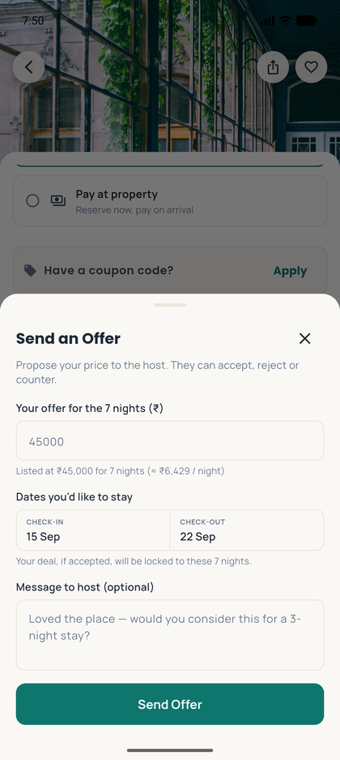
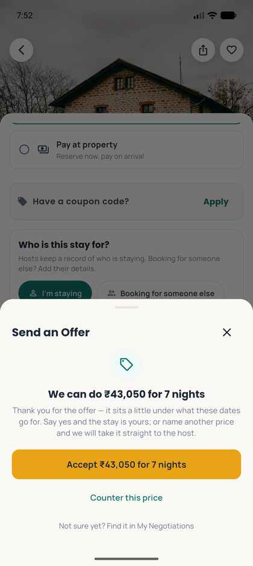
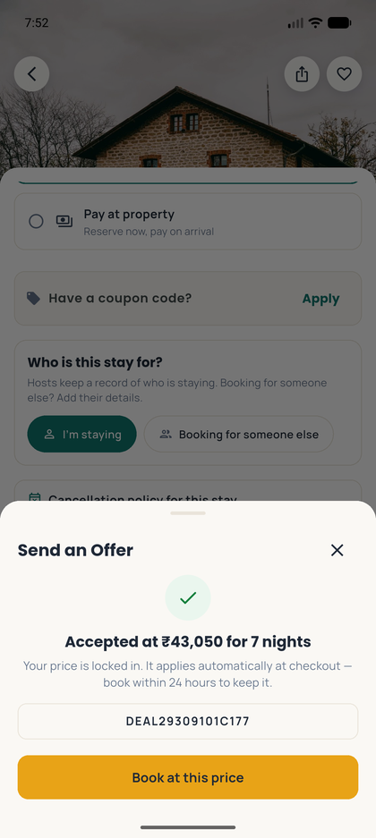
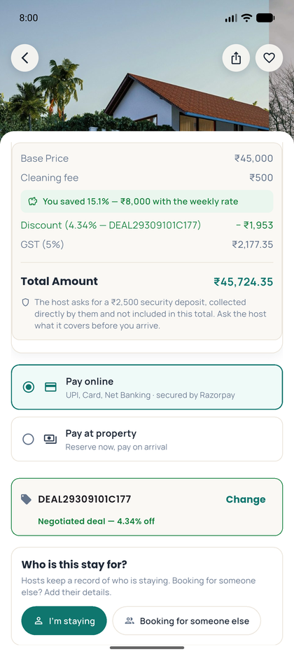
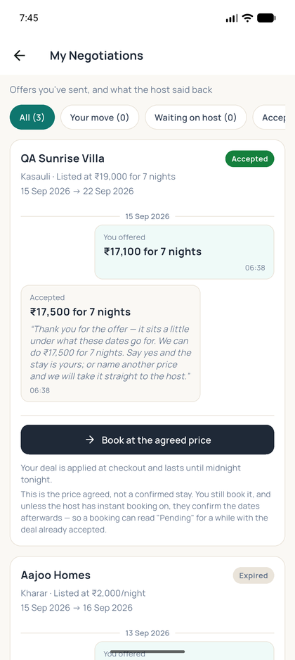

# Negotiating a Week or a Month — How It Works Now

> **Postscript, 15 September evening.** After this document was written the client decided that the **cleaning fee is stated, not charged**: the listing says what the host charges for cleaning (under Things to know and under every total), and a guest who wants it arranges and pays it with the host directly. The negotiation rule below is unchanged — the deal is still a percentage of the room and the fees still ride through undiscounted — but the cleaning fee is no longer one of those fees. Where a figure in this document includes cleaning (₹18,898.95, ₹74,025, ₹1,58,025, the ₹500 lines), read it without: the QA Sunrise Villa week under the ₹17,500 deal is now ₹17,499 + 5% = **₹18,373.95**, the month ₹73,500, the Gurgaon month ₹1,57,500. The photographs show the screens as they were that morning; the same screens now carry the sentence *"The host charges ₹500 for cleaning if you ask for it — arranged and paid directly with them, not included in this total"* under the total instead of a cleaning line.

## 1. What changed, and why

On 15 September the client looked at the Send an Offer dialog on a seven-night stay and asked why it wanted a price **per night**:

> "While negotiating for weekly or monthly booking, renter should be asked total price instead of per night?? Renter will not be able to calculate easily per night and negotiate for long bookings … I believe for less than 7 days, per night negotiations is fine. But for weekly and monthly it should be on the total."

They were right, and the platform now does exactly that. This document explains the rule, walks the guest's and the host's flow with real numbers from the live site and the app, and says what happens underneath — what is stored, how the engine decides, how the agreed price becomes the amount charged.

**The rule, in one table:**

| The stay | What the guest is asked | What everyone sees |
|---|---|---|
| under 7 nights | a price **per night** — exactly as before | "₹3,000/night" |
| **7 nights or more** | a price **for the whole stay** | "₹75,000 for 7 nights — the host's weekly rate (≈ ₹10,714 / night)" |

Seven is not arbitrary: it is the same line the host's **weekly rate** is drawn at. A stay of 7 nights or more is priced by the week (and a calendar month by the month), so the number the guest is arguing about is one figure — the host's rate for the stay — not seven equal sevenths of it.

## 2. The guest's flow

### 2.1 Choosing dates and opening the dialog

The guest picks their dates on the listing and taps **Send an Offer**. Two things decide what the dialog asks for:

- **How long the stay is.** Under 7 nights the box says *Your offer per night (₹)*; from 7 nights it says *Your offer for the 7 nights (₹)* and is pre-filled with the stay's listed total.
- **What the stay lists at.** Under the box: *Listed at ₹19,000 for 7 nights — the host's weekly rate (≈ ₹2,714 / night)*. The per-night figure is shown in brackets so a guest who still thinks per night can, but the number being negotiated is the total.

*Web, live: a seven-night stay asks for a total against the weekly rate*

*Web, live: two nights on the same listing still ask per night*

*App, build 93: the same seven-night stay — "Your offer for the 7 nights", listed at ₹45,000 for 7 nights*

**Two guards before the offer goes anywhere.** An offer at or above what the stay lists at is stopped on the spot ("These 7 nights are ₹19,000 in total — offer less than that, or just book it"): a negotiation argues the price down, and an over-list offer is almost always a typo. And the dialog will not send an offer with no dates — the host agrees to the dates along with the price, and the deal is locked to them.

### 2.2 What comes back

The platform answers immediately, in the same unit the guest spoke in. There are three outcomes:

| The offer is… | What happens | What the guest reads |
|---|---|---|
| at or above the host's **target** price for those dates | **Accepted on the spot.** A deal coupon is minted and the guest can book. | "Accepted at ₹17,500 for 7 nights. Your price is locked in — book before midnight tonight to keep it." |
| under the target but above the host's **floor** | **Countered**, once, by the platform — a step from the list price toward the target, in the host's name and at the host's own rate. The guest can accept it or counter back; a counter-back goes to the host. | "We can do ₹17,500 for 7 nights. Say yes and the stay is yours; or name another price and we will take it straight to the host." |
| under the host's **floor** | **Sent to the host**, who can accept, counter or decline within their stated reply time. | "Your price is with the host. They can accept, decline or counter, and you'll be notified either way." |

*Web, live: the platform's counter, in the stay's unit*

*App, build 93: "We can do ₹43,050 for 7 nights"*

*App, build 93: accepted at ₹43,050 for 7 nights, with the deal code*

### 2.3 Booking at the agreed price

An accepted deal is a **personal, date-locked coupon**, good until midnight tonight (IST). It reaches the guest three ways, and all three open the listing with the dates pinned and the deal applied: the **Accepted** panel's "Book at this price"; the deal banner on the home screen and dashboard; and **My Negotiations → Book at the agreed price**.

From there the price is shown once, the same way, on every screen — the listing's price card, the review page and the payment page — and the Razorpay sheet opens for the same rupees and paise.

*Web, live, 15 Sep morning: the property card under a weekly deal — ₹19,000 − ₹1,501 + ₹500 cleaning, GST ₹899.95, total ₹18,898.95. Since the evening the ₹500 is stated under the total, not in it: ₹17,499 + GST ₹874.95 = ₹18,373.95.*

*Web, live: the review page — the same lines, the same total*

*Web, live: the payment page — "Pay ₹18,898.95 Securely"*

*App, build 93: the deal applied — Discount (4.34%) −₹1,953 · GST (5%) ₹2,177.35 · Total ₹45,724.35, which is to the paise what the server charges*

### 2.4 My Negotiations

Every thread is listed in the unit it was negotiated in. A weekly thread reads *Listed at ₹19,000 for 7 nights · You offered ₹17,100 for 7 nights · Accepted ₹17,500 for 7 nights*; a one-night thread beside it still reads per night.

*Web, live: a weekly thread on My Negotiations*

*App, build 93: the same threads*

## 3. The host's flow

The host is never asked to think in a unit the guest did not use. Everything the host receives about a long stay says the total:

| Moment | What the host reads |
|---|---|
| A new offer under their floor | Notification and email: *"A guest offered ₹40,000 for 7 nights for cottage at gurgaon…"* — with the dates, the guest's name and the listed total beside it |
| The platform answered on their behalf | *"A guest offered ₹40,000 for 7 nights … We quoted them ₹43,050 for 7 nights — your own rate for these nights."* |
| An offer accepted automatically | *"₹43,050 for 7 nights for cottage at gurgaon… — at or above your target price, so it was accepted for you."* |
| The guest countered back | *"New offer of ₹42,000 for 7 nights on cottage at gurgaon…"* |
| Countering, on the Negotiations page | The counter box asks *Your counter for the 7 nights (₹) *, shows the guest's offer and the listed price as totals, and refuses a counter below the guest's own offer |
| Accepting | *"You will host [guest] at ₹43,050 for 7 nights for 15-09-2026 → 22-09-2026. They get a one-time deal, good until midnight tonight."* |
| An offer expired unanswered | The guest is told *"your offer of ₹40,000 for 7 nights expired"* |

The host's Negotiations page — website and app — shows each thread the same way the guest's does: the offered total, the listed total, the transcript in totals, and "for 7 nights" where the guest sees it.

## 4. A month

A month works exactly like a week, with the **calendar month** as the stay: 31 nights in October, 30 in September, 28 or 29 in February. The host's **monthly rate** is the listed total the guest negotiates against.

Two real listings, quoted on 15 September for 15 September → 15 October (30 nights):

| Listing | Nightly, one at a time | Monthly rate | Cleaning (stated, not charged) | GST | Total |
|---|---|---|---|---|---|
| QA Sunrise Villa | ₹97,200 | **₹70,000** | ₹500 | ₹3,500 (5%) | ₹73,500 |
| Cottage at Gurgaon | ₹2,26,000 | **₹1,50,000** | ₹500 | ₹7,500 (5%) | ₹1,57,500 |

On either, the dialog reads *Your offer for the 30 nights (₹)* and *Listed at ₹70,000 for 30 nights — the host's monthly rate (≈ ₹2,333 / night)*. An offer of ₹65,000 is a 7.15% deal; the guest pays 65,000 + GST, and every night's share stays under ₹7,500, so 5% — ₹68,250, with the ₹500 cleaning stated under it for the guest to arrange with the host if wanted.

## 5. Underneath — what is stored, and how the price is decided

This section is for whoever has to reason about a dispute or read the database.

### 5.1 The unit of record did not change

Every offer, counter, socket event and coupon still carries a **per-night** figure. This was a deliberate choice: the ledger (`tbl_negotiation_offers.offer_price`, `tbl_negotiation_log.nl_offer_price`), the engine's min/ideal/max and the coupon arithmetic are all per night, and changing the stored unit would have rewritten all of them for a sentence's worth of difference.

So:

- A guest who types **₹42,000 for 7 nights** sends **₹6,000/night**. A host who counters **₹1,00,000 for a week** sends **₹14,285.71/night** (the column is two-decimal).
- Every screen multiplies back and rounds to the rupee, which recovers the typed total exactly for any stay under a hundred nights (the largest possible error is 0.005 × nights).
- One helper per platform decides the unit from the stay length — `utils/negotiationUnit.js` on the server, `lib/negotiationUnit.ts` on the website, `utils/negotiation_unit.dart` in the app — and every sentence, label and toast goes through it. The threshold is asserted equal to the weekly-rate threshold by a test, so the two cannot drift apart.

### 5.2 How the engine judges a long-stay offer

The engine has priced dated offers against the **composite stay** since the pricing engine shipped (W2): for the dates offered it works out the host's minimum, target and maximum **totals** — using the weekly or monthly rate when the stay earns one, and weekend or seasonal rates otherwise — and divides each back to per night. The offer is compared with those. The decision is unchanged:

1. **At or above the target** → accepted on the spot.
2. **Between the floor and the target** → the platform counters once, stepping from the list price toward the target by how close the offer came, rounded to ₹50.
3. **Below the floor** → the host decides, within their reply time.

Offers **above the list price** are refused, and an offer with no dates is judged against the flat nightly columns (the chat path).

### 5.3 From an agreed price to a coupon to a charge

When a deal is struck, the server mints a **percentage coupon** against the stay's **room subtotal at list price** — chosen so that the percentage reproduces the agreed price exactly:

> QA Sunrise Villa, 7 nights, weekly rate ₹19,000, agreed ₹17,500 → 1 − 17,500 ÷ 19,000 = 7.894…% → stored **7.9%** (rounded *up* to two decimals, so the guest is never billed above the agreed price).

At checkout the coupon is applied to the **room only** — never to the extra-guest charge or the pet fee (and the cleaning fee, since the evening of 15 September, is stated rather than charged, so it is in no sum at all). Then GST is worked out **per night on what is actually charged**: the payable amount is split across the nights in proportion to their list rates, each night's share under ₹7,500 is taxed at 5%, ₹7,500 and above at 18%, and the tax is rounded once. A deal can move a night across the ₹7,500 line — on the Gurugram cottage the Sunday's share is ₹7,642 at list (18%) and ₹7,310 after the 4.34% deal (5%) — and the label says which bands were used rather than printing a blended average as if it were a rate.

The booking record then carries the price the client can reconcile: `book_price` (room after the deal, plus fees), `book_discount_amt` (the deal), `book_tax` (GST), `book_total_amt` (what Razorpay collects).

### 5.4 Rules that did not move

- **A deal is for its dates.** The coupon carries the offer's dates; a different stay is refused at checkout with "This deal is for X to Y".
- **Midnight tonight, IST.** The deal window is the calendar day, not 24 hours.
- **One negotiation per guest per listing per day** after a host declines — the host's last price is left on the table for an hour, then the listing returns to its normal price for that guest.
- **A counter has to move the right way** — a guest down from the host's number, a host up from the guest's — or the client refuses it before it is sent.
- **Offers are for stays starting today.** An advance booking is not negotiated: it is booked at the listed price, with the option of paying 10% now. The website does not draw the offer button on an advance stay; the app tells the guest why.

### 5.5 A word on "starting today"

Because offers are only taken on a stay that starts today, a listing whose host has switched **same-day bookings off** cannot be negotiated on at all — the guest cannot pick a start date the engine will accept. On 15 September the client met exactly this on their own test listing ("renter cannot select today… so cannot negotiate at all"). Two things were wrong and both are fixed:

- The **web wizard** had been loading a listing that never answered the same-day question as "No" — and writing that No the next time the host saved *any* step. Five test listings had gone that way; none of their hosts chose it. The wizard now reads a blank as Yes (which is how the server has always read it), defaults a new listing to Yes, and **warns a host who turns same-day off while negotiation is on**: *"Price offers are only taken on a stay that starts today. With same-day bookings off, guests cannot send you an offer at all."* The app's wizard carries the same warning.
- The five rows are put back by `scripts/repairSameDay_2026-09-15.js` (dry run by default, `--apply` to write) — a one-line repair that the development sandbox is not permitted to run against production, so it is left for the client to run, the same way the ledger repair was.

## 6. Where each piece lives

| Piece | Server | Website | App |
|---|---|---|---|
| The unit rule | `utils/negotiationUnit.js` | `redesign/lib/negotiationUnit.ts` | `utils/negotiation_unit.dart` |
| The offer dialog / sheet | — | `pages/PropertyDetail.tsx` | `widgets/send_offer_sheet.dart` |
| The counter dialog | — | `components/CounterOfferDialog.tsx` | `guest_negotiations_screen.dart`, `host_negotiations_screen.dart` |
| Every sentence the server writes | `services/negotiationService.js`, `controllers/user.controller.js`, `controllers/host.controller.js`, `services/negotiationExpiry.js`, `utils/negotiationCoupon.js` | — | — |
| The engine's decision | `services/negotiationEngine.js` (`decideOffer`), `negotiationService.tiersForDates` | — | — |
| The deal coupon | `utils/negotiationCoupon.js` | — | — |
| Coupon on the room, GST per night | `controllers/booking.controller.js`, `utils/couponApply.js`, `utils/methods.js` | `redesign/lib/bookingDraft.ts` | `utils/booking_pricing.dart` |
| Tests | `aWeekIsNegotiatedAsATotal`, `aCouponIsOnTheRoom`, `negotiatedPriceIsCharged`, `quoteMatchesCharge` | `aWeekIsNegotiatedAsATotal.test.mjs`, `aCouponIsOnTheRoom.test.mjs` | `a_week_is_negotiated_as_a_total_test.dart`, `a_coupon_is_on_the_room_test.dart`, `booking_pricing_test.dart` |
